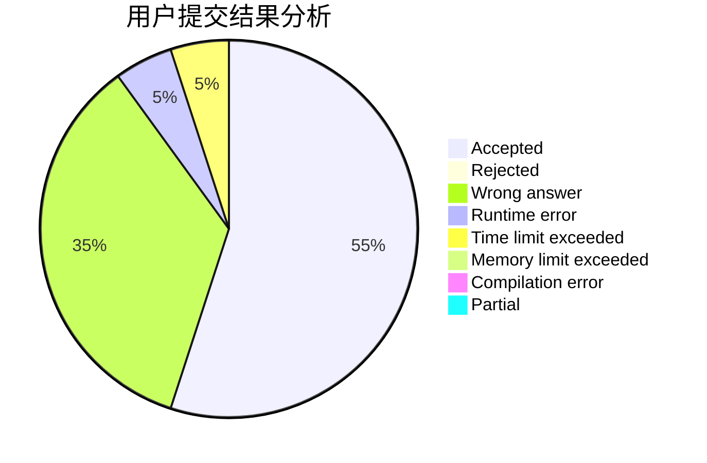
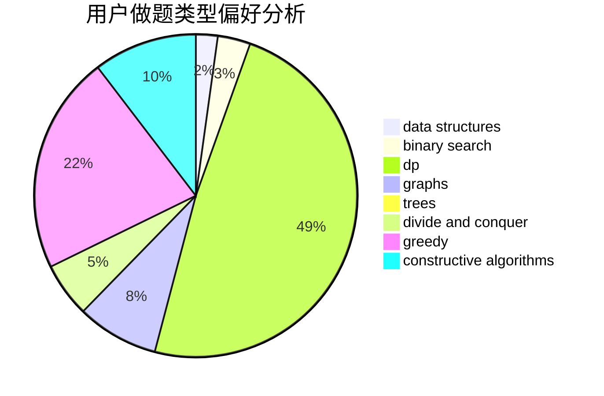
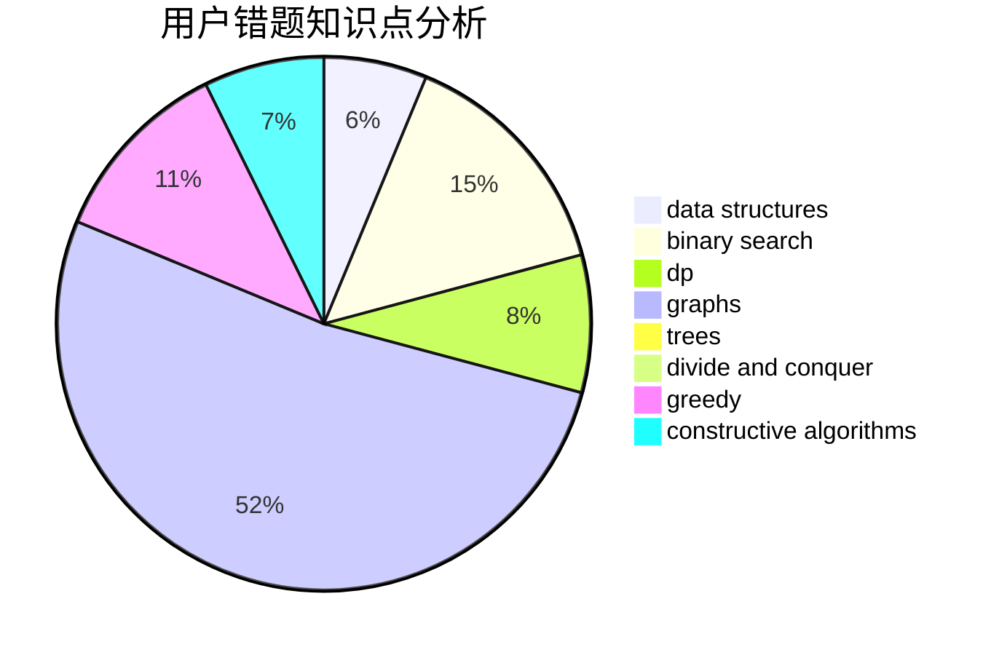

# xgzc

<!-- tabs:start -->

#### **用户提交结果分析**

#### **用户做题类型偏好分析**

#### **用户错题知识点分析**

<!-- tabs:end -->
# 推荐题目
[1418C](https://codeforces.com/contest/1418/problem/C)		dp,
                        graphs,
                        greedy,
                        shortest paths		  
[903B](https://codeforces.com/contest/903/problem/B)		greedy,
                        implementation		  
[1315D](https://codeforces.com/contest/1315/problem/D)		dsu,graphs,sortings,trees		  
[890C](https://codeforces.com/contest/890/problem/C)		dsu,graphs,sortings,trees		  
[1092B](https://codeforces.com/contest/1092/problem/B)		sortings		  
[858A](https://codeforces.com/contest/858/problem/A)		brute force,
                        math,
                        number theory		  
[200B](https://codeforces.com/contest/200/problem/B)		implementation,
                        math		  
[442C](https://codeforces.com/contest/442/problem/C)		data structures,
                        greedy		  
[979D](https://codeforces.com/contest/979/problem/D)		binary search,
                        bitmasks,
                        brute force,
                        data structures,
                        dp,
                        dsu,
                        greedy,
                        math,
                        number theory,
                        strings,
                        trees		  
[377C](https://codeforces.com/contest/377/problem/C)		bitmasks,
                        dp,
                        games		  
