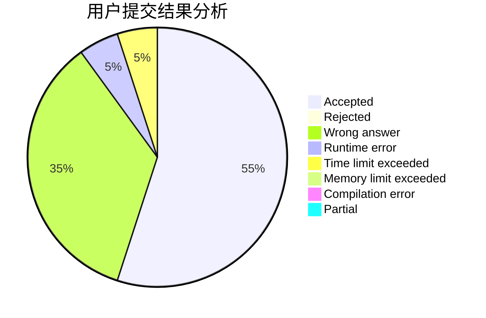
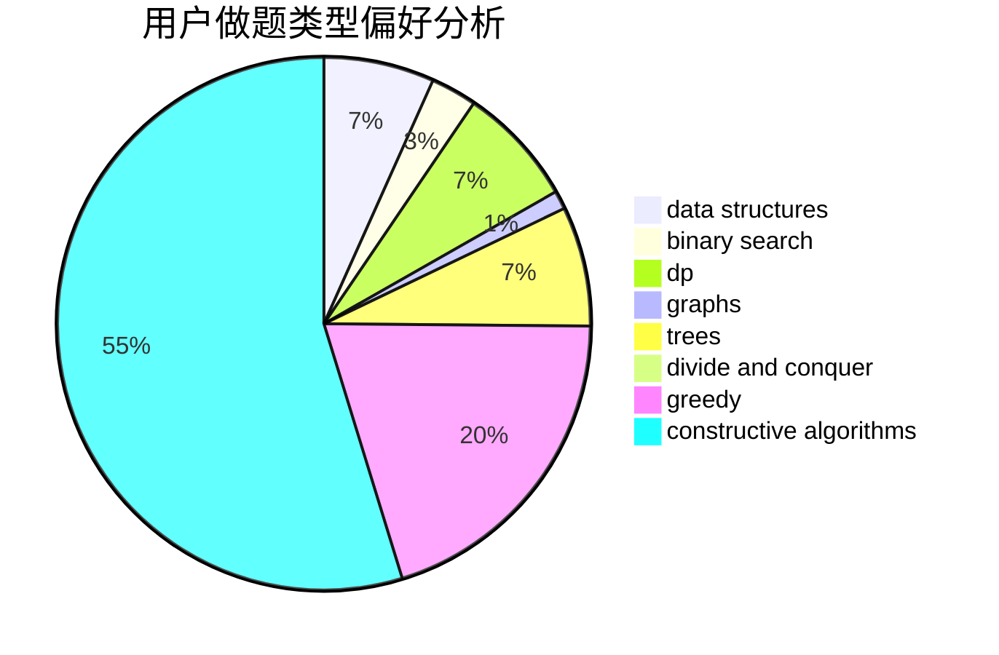
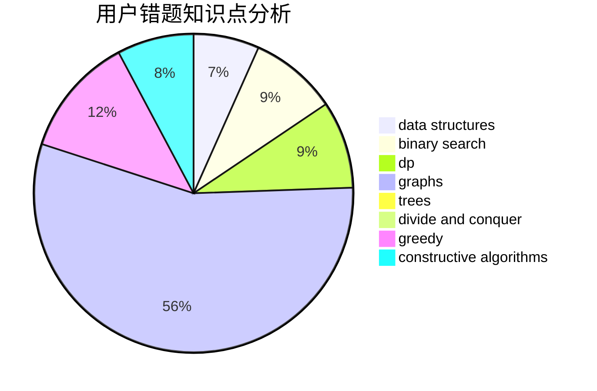

# xgzc

<!-- tabs:start -->

#### **用户提交结果分析**

#### **用户做题类型偏好分析**

#### **用户错题知识点分析**

<!-- tabs:end -->
# 推荐题目
[1425H](https://codeforces.com/contest/1425/problem/H)		constructive algorithms		  
[919C](https://codeforces.com/contest/919/problem/C)		brute force,
                        implementation		  
[1325C](https://codeforces.com/contest/1325/problem/C)		constructive algorithms,
                        dfs and similar,
                        greedy,
                        trees		  
[909D](https://codeforces.com/contest/909/problem/D)		data structures,
                        greedy,
                        implementation		  
[1092E](https://codeforces.com/contest/1092/problem/E)		constructive algorithms,
                        dfs and similar,
                        greedy,
                        trees		  
[876A](https://codeforces.com/contest/876/problem/A)		math		  
[225D](https://codeforces.com/contest/225/problem/D)		bitmasks,
                        dfs and similar,
                        graphs,
                        implementation		  
[463A](https://codeforces.com/contest/463/problem/A)		brute force,
                        implementation		  
[993D](https://codeforces.com/contest/993/problem/D)		binary search,
                        dp,
                        greedy		  
[405D](https://codeforces.com/contest/405/problem/D)		greedy,
                        implementation,
                        math		  
