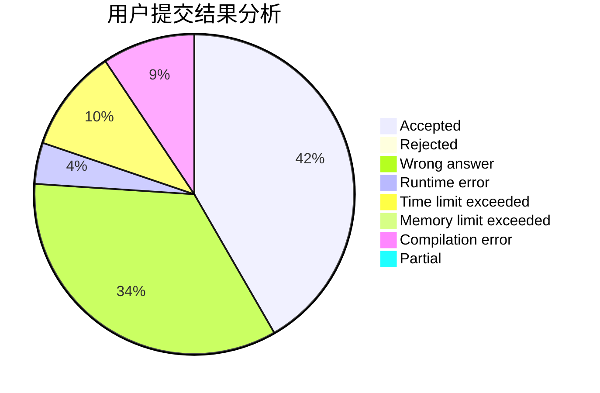
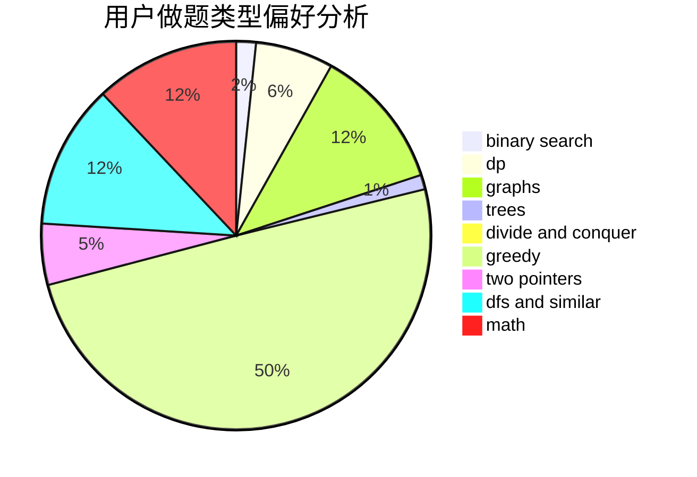

# xhgybbybz

<!-- tabs:start -->

#### **用户提交结果分析**

#### **用户做题类型偏好分析**

<!-- tabs:end -->
# 推荐题目
[1500D](https://codeforces.com/contest/1500/problem/D)
[1017D](https://codeforces.com/contest/1017/problem/D)
[1251F](https://codeforces.com/contest/1251/problem/F)
[1510A](https://codeforces.com/contest/1510/problem/A)
[13681](https://codeforces.com/contest/1368/problem/1)
[319C](https://codeforces.com/contest/319/problem/C)
[1B](https://codeforces.com/contest/1/problem/B)
[559D](https://codeforces.com/contest/559/problem/D)
[1252J](https://codeforces.com/contest/1252/problem/J)
[922D](https://codeforces.com/contest/922/problem/D)
