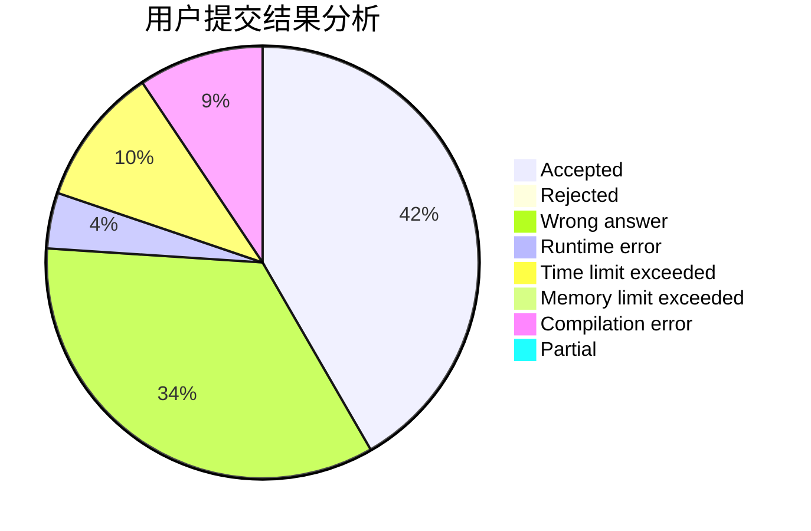
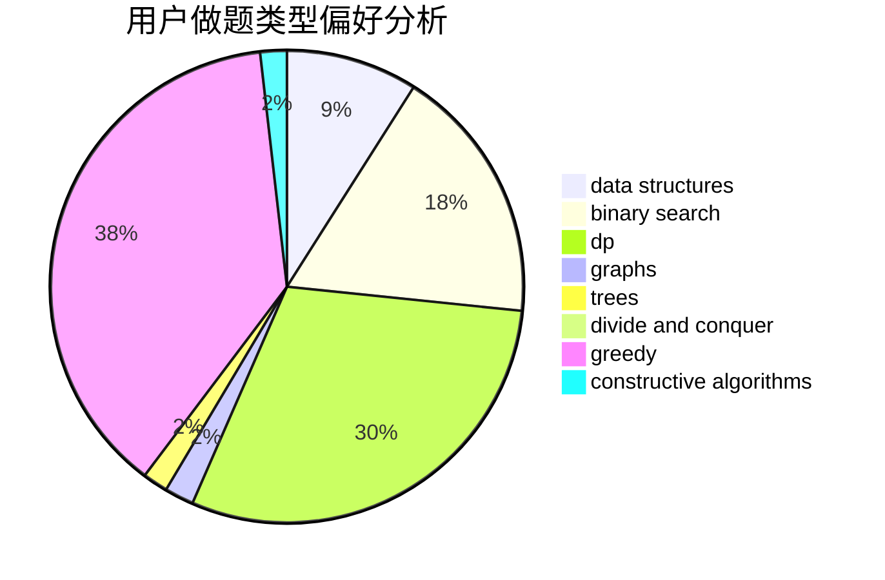
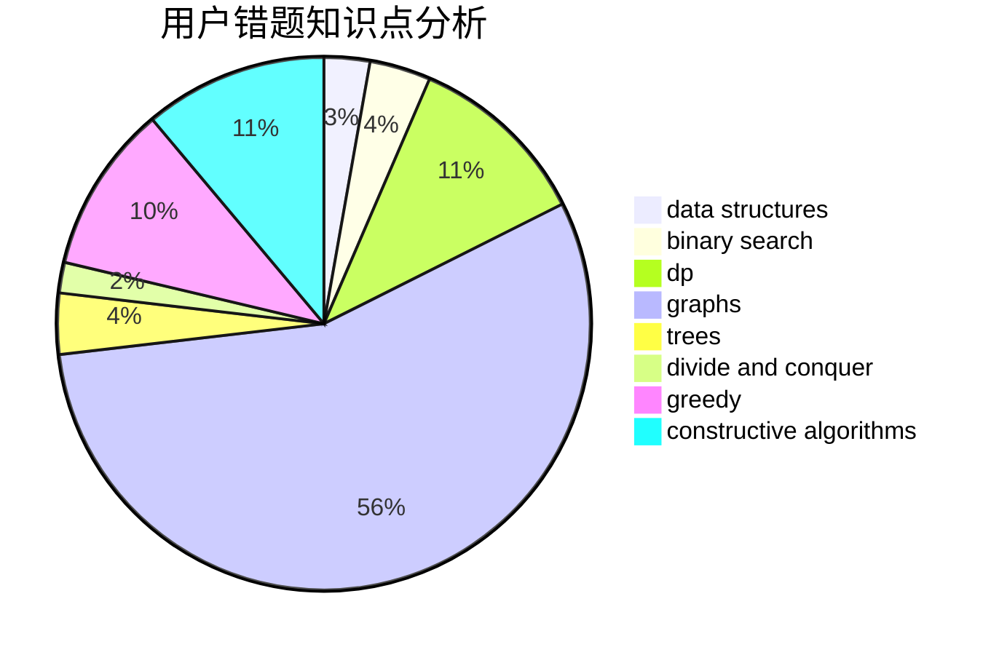

# xhgybbybz

<!-- tabs:start -->

#### **用户提交结果分析**

#### **用户做题类型偏好分析**

#### **用户错题知识点分析**

<!-- tabs:end -->
# 推荐题目
[1492C](https://codeforces.com/contest/1492/problem/C)		binary search,
                        data structures,
                        dp,
                        greedy,
                        two pointers		  
[1017A](https://codeforces.com/contest/1017/problem/A)		implementation		  
[1247F](https://codeforces.com/contest/1247/problem/F)		dsu,graphs,sortings,trees		  
[149E](https://codeforces.com/contest/149/problem/E)		string suffix structures,
                        strings		  
[135B](https://codeforces.com/contest/135/problem/B)		brute force,
                        geometry,
                        math		  
[300E](https://codeforces.com/contest/300/problem/E)		binary search,
                        math,
                        number theory		  
[174B](https://codeforces.com/contest/174/problem/B)		dp,
                        greedy,
                        implementation		  
[538C](https://codeforces.com/contest/538/problem/C)		binary search,
                        brute force,
                        greedy,
                        implementation,
                        math		  
[1249B1](https://codeforces.com/contest/1249B/problem/1)		dsu,
                        math		  
[908C](https://codeforces.com/contest/908/problem/C)		brute force,
                        geometry,
                        implementation,
                        math		  
