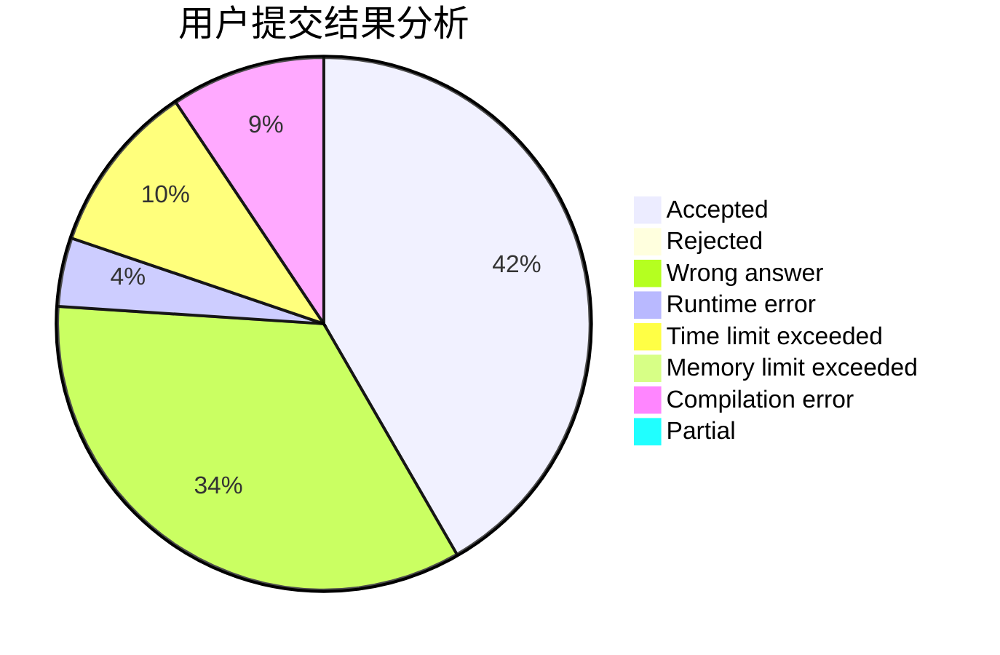
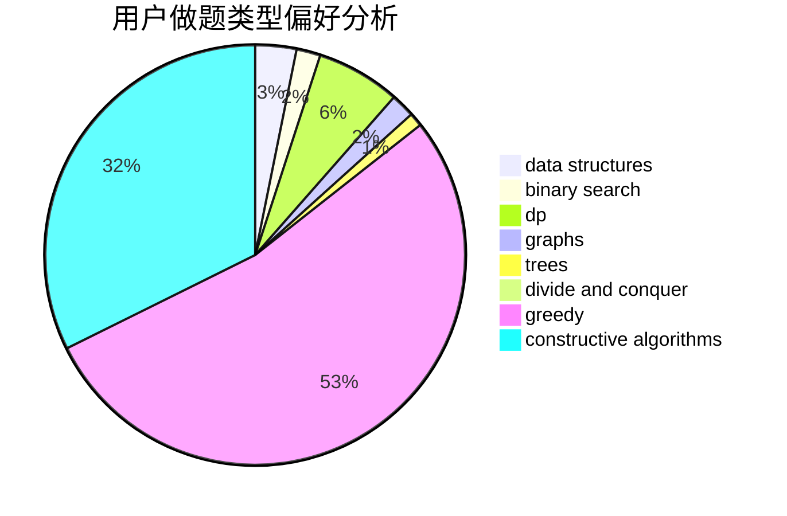
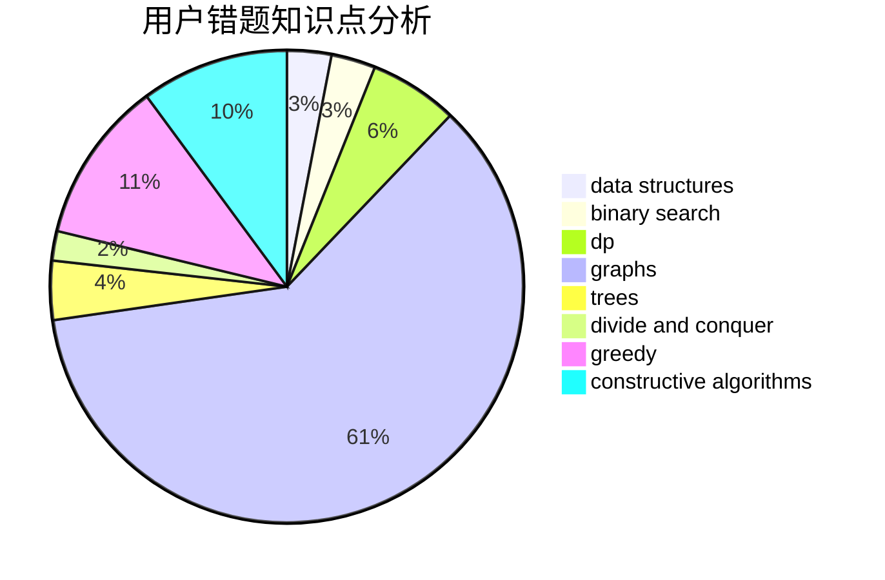

# xhgybbybz

<!-- tabs:start -->

#### **用户提交结果分析**

#### **用户做题类型偏好分析**

#### **用户错题知识点分析**

<!-- tabs:end -->
# 推荐题目
[1500D](https://codeforces.com/contest/1500/problem/D)		data structures,
                        sortings,
                        two pointers		  
[1017D](https://codeforces.com/contest/1017/problem/D)		bitmasks,
                        brute force,
                        data structures		  
[1251F](https://codeforces.com/contest/1251/problem/F)		combinatorics,
                        fft		  
[1510A](https://codeforces.com/contest/1510/problem/A)		nan		  
[13681](https://codeforces.com/contest/1368/problem/1)		dsu,graphs,sortings,trees		  
[319C](https://codeforces.com/contest/319/problem/C)		dp,
                        geometry		  
[1B](https://codeforces.com/contest/1/problem/B)		implementation,
                        math		  
[559D](https://codeforces.com/contest/559/problem/D)		combinatorics,
                        geometry,
                        probabilities		  
[1252J](https://codeforces.com/contest/1252/problem/J)		brute force,
                        dp		  
[922D](https://codeforces.com/contest/922/problem/D)		greedy,
                        sortings		  
