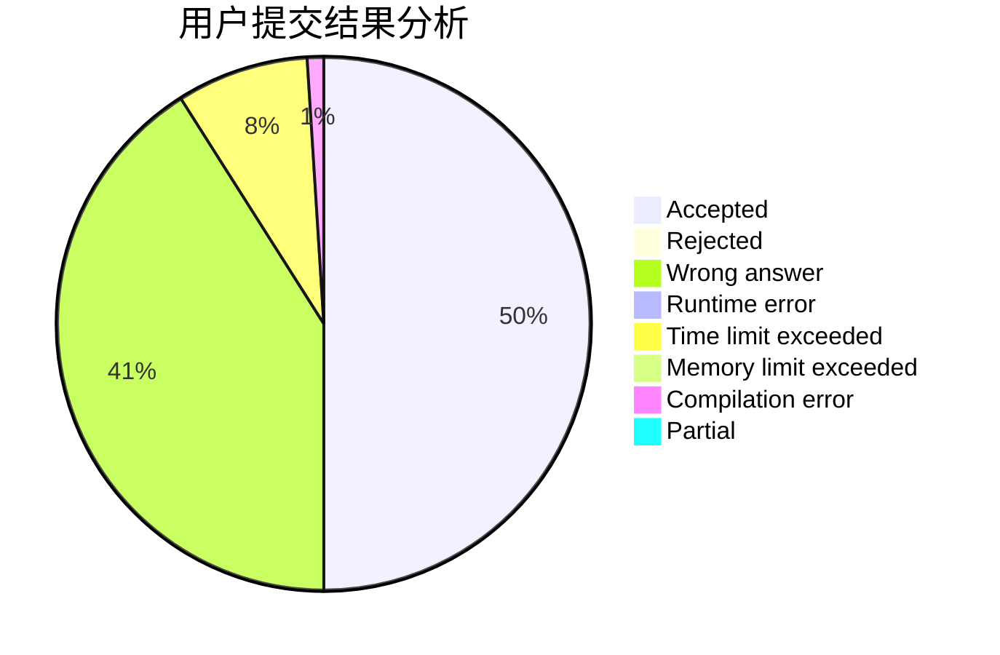
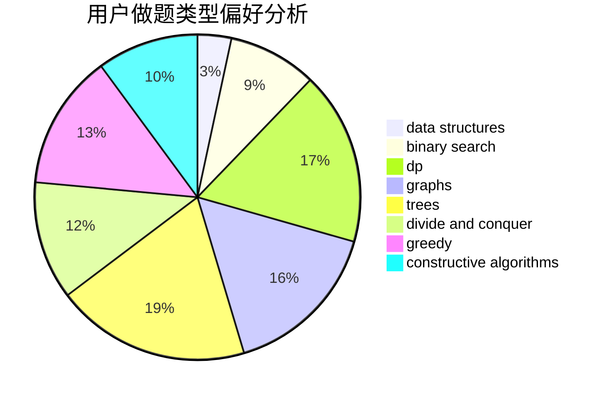
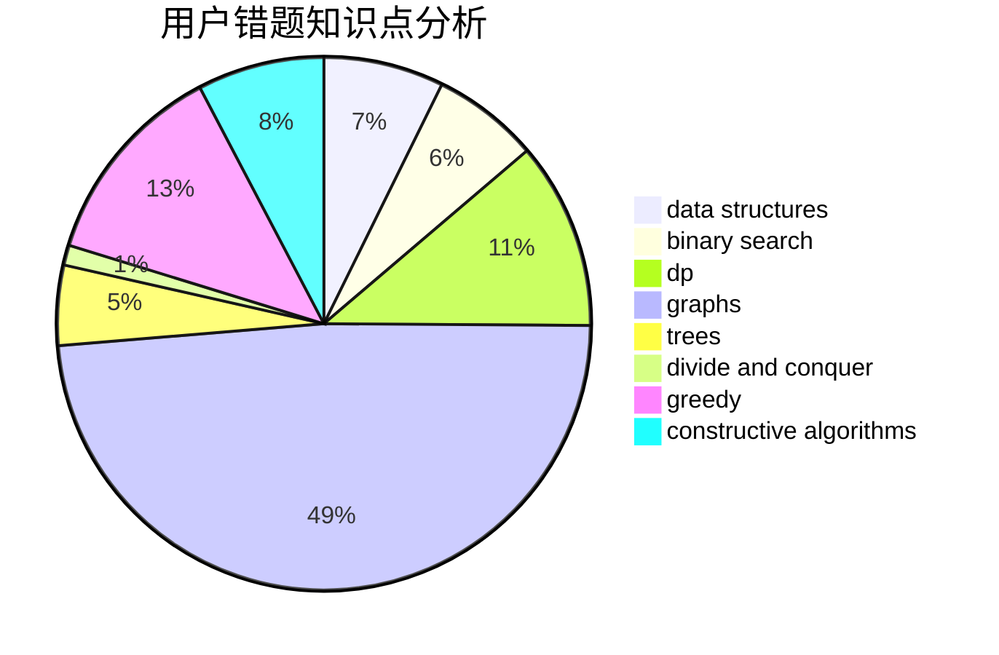

# xiahongyu

<!-- tabs:start -->

#### **用户提交结果分析**

#### **用户做题类型偏好分析**

#### **用户错题知识点分析**

<!-- tabs:end -->
# 推荐题目
[1104D](https://codeforces.com/contest/1104/problem/D)		dsu,graphs,sortings,trees		  
[476B](https://codeforces.com/contest/476/problem/B)		bitmasks,
                        brute force,
                        combinatorics,
                        dp,
                        math,
                        probabilities		  
[407B](https://codeforces.com/contest/407/problem/B)		dp,
                        implementation		  
[1221G](https://codeforces.com/contest/1221/problem/G)		bitmasks,
                        brute force,
                        combinatorics,
                        dp,
                        meet-in-the-middle		  
[1051A](https://codeforces.com/contest/1051/problem/A)		greedy,
                        implementation,
                        strings		  
[1176C](https://codeforces.com/contest/1176/problem/C)		dp,
                        greedy,
                        implementation		  
[898C](https://codeforces.com/contest/898/problem/C)		implementation,
                        strings		  
[476A](https://codeforces.com/contest/476/problem/A)		implementation,
                        math		  
[1120A](https://codeforces.com/contest/1120/problem/A)		greedy,
                        implementation,
                        two pointers		  
[748C](https://codeforces.com/contest/748/problem/C)		constructive algorithms,
                        math		  
