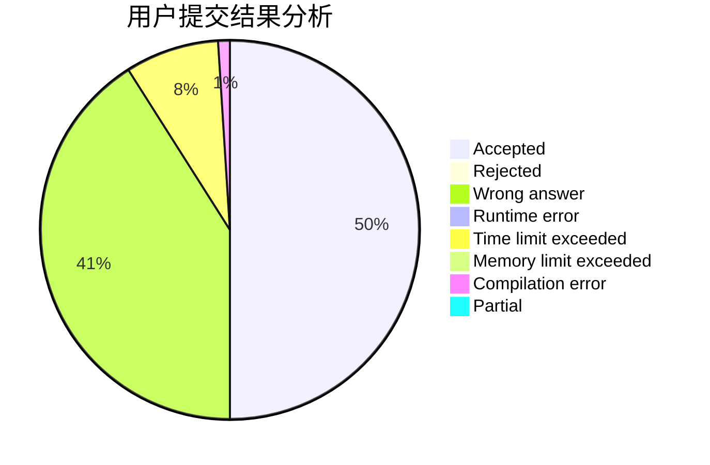
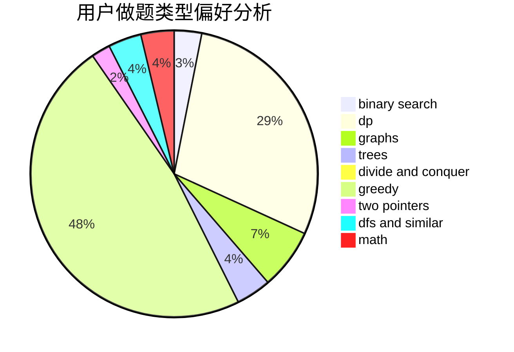

# xiahongyu

<!-- tabs:start -->

#### **用户提交结果分析**

#### **用户做题类型偏好分析**

<!-- tabs:end -->
# 推荐题目
[1105B](https://codeforces.com/contest/1105/problem/B)
[495B](https://codeforces.com/contest/495/problem/B)
[436A](https://codeforces.com/contest/436/problem/A)
[122C](https://codeforces.com/contest/122/problem/C)
[1051D](https://codeforces.com/contest/1051/problem/D)
[1179D](https://codeforces.com/contest/1179/problem/D)
[914E](https://codeforces.com/contest/914/problem/E)
[494E](https://codeforces.com/contest/494/problem/E)
[1129E](https://codeforces.com/contest/1129/problem/E)
[767D](https://codeforces.com/contest/767/problem/D)
