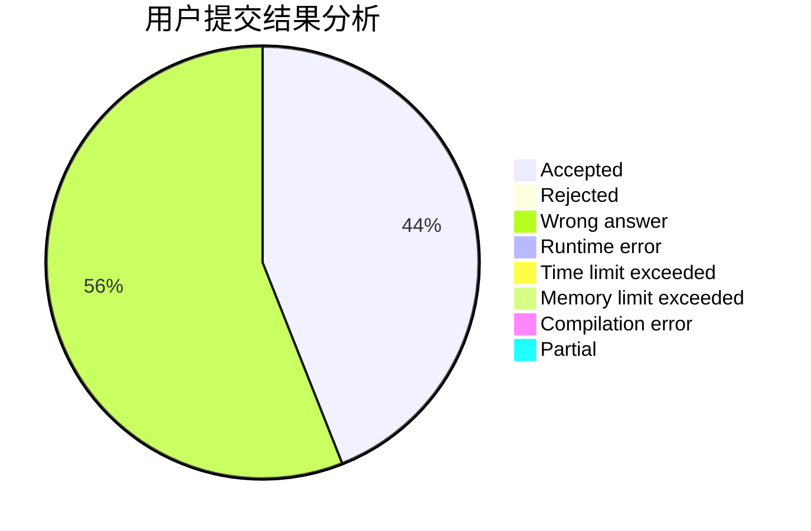
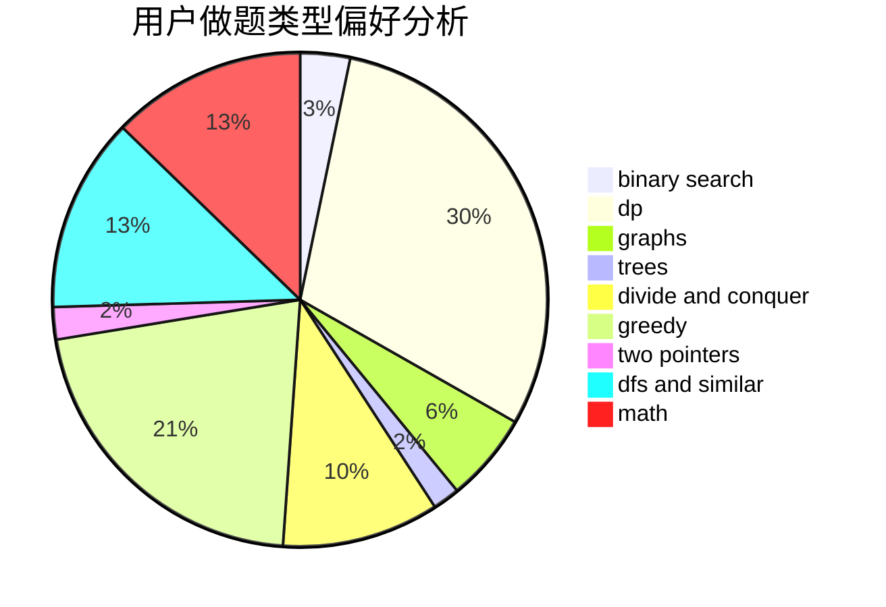

# xiaoHaoMingziSuiBianqu

<!-- tabs:start -->

#### **用户提交结果分析**

#### **用户做题类型偏好分析**

<!-- tabs:end -->
# 推荐题目
[607E](https://codeforces.com/contest/607/problem/E)
[385E](https://codeforces.com/contest/385/problem/E)
[581B](https://codeforces.com/contest/581/problem/B)
[472G](https://codeforces.com/contest/472/problem/G)
[7E](https://codeforces.com/contest/7/problem/E)
[1162E](https://codeforces.com/contest/1162/problem/E)
[1113D](https://codeforces.com/contest/1113/problem/D)
[711C](https://codeforces.com/contest/711/problem/C)
[960C](https://codeforces.com/contest/960/problem/C)
[705A](https://codeforces.com/contest/705/problem/A)
