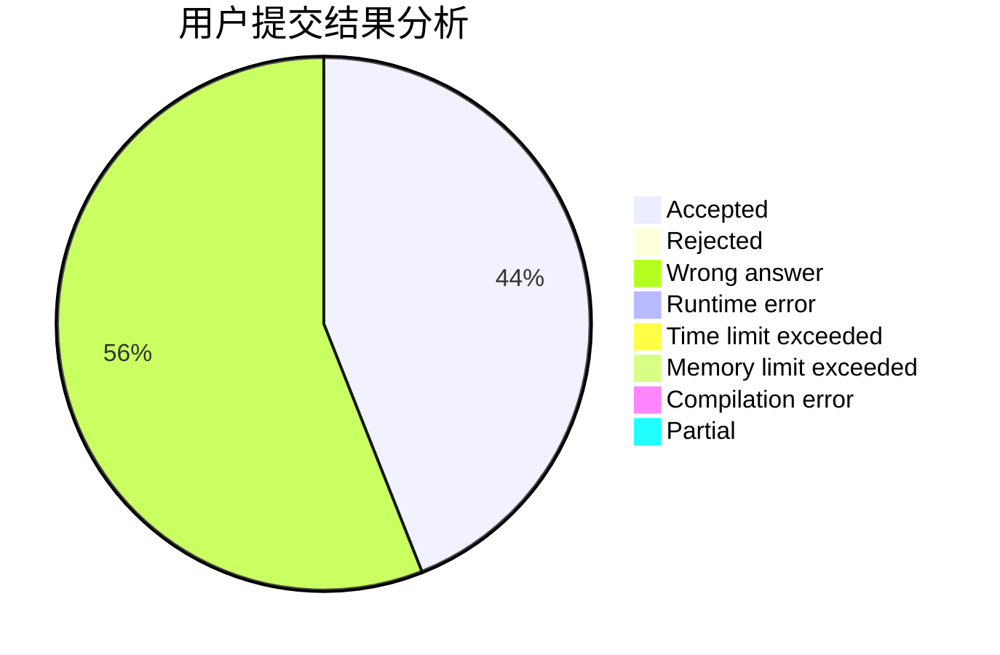
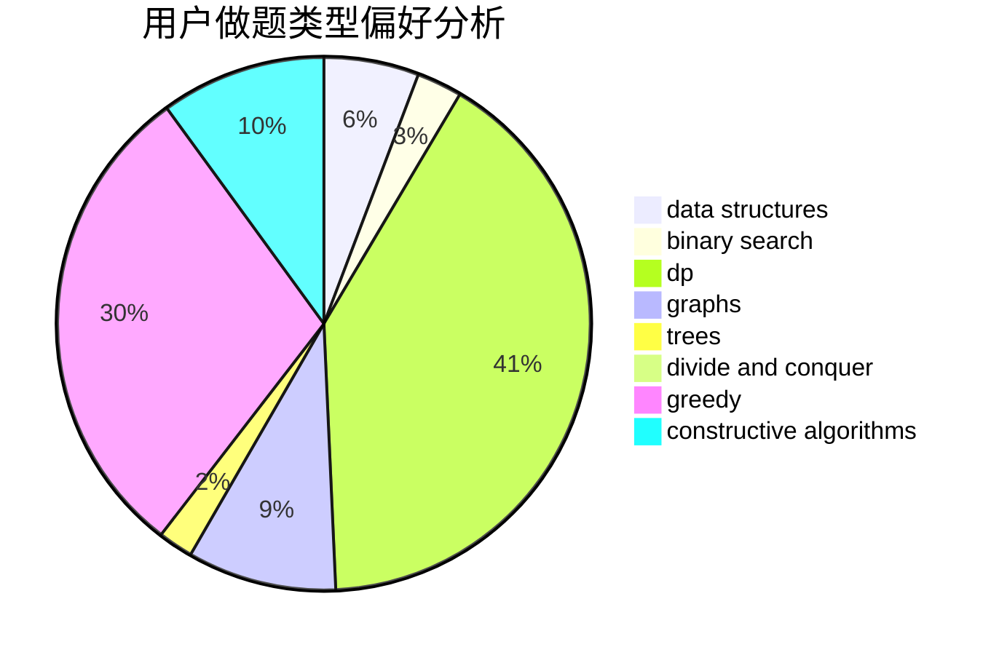

# xiaoHaoMingziSuiBianqu

<!-- tabs:start -->

#### **用户提交结果分析**

#### **用户做题类型偏好分析**

#### **用户错题知识点分析**

<!-- tabs:end -->
# 推荐题目
[607E](https://codeforces.com/contest/607/problem/E)		binary search,
                        geometry		  
[385E](https://codeforces.com/contest/385/problem/E)		math,
                        matrices		  
[581B](https://codeforces.com/contest/581/problem/B)		implementation,
                        math		  
[472G](https://codeforces.com/contest/472/problem/G)		bitmasks,
                        data structures,
                        fft		  
[7E](https://codeforces.com/contest/7/problem/E)		dp,
                        expression parsing,
                        implementation		  
[1162E](https://codeforces.com/contest/1162/problem/E)		dsu,graphs,sortings,trees		  
[1113D](https://codeforces.com/contest/1113/problem/D)		dsu,graphs,sortings,trees		  
[711C](https://codeforces.com/contest/711/problem/C)		dp		  
[960C](https://codeforces.com/contest/960/problem/C)		bitmasks,
                        constructive algorithms,
                        greedy,
                        implementation		  
[705A](https://codeforces.com/contest/705/problem/A)		implementation		  
