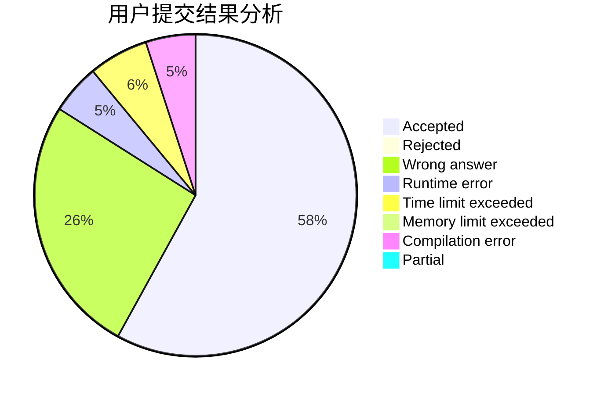
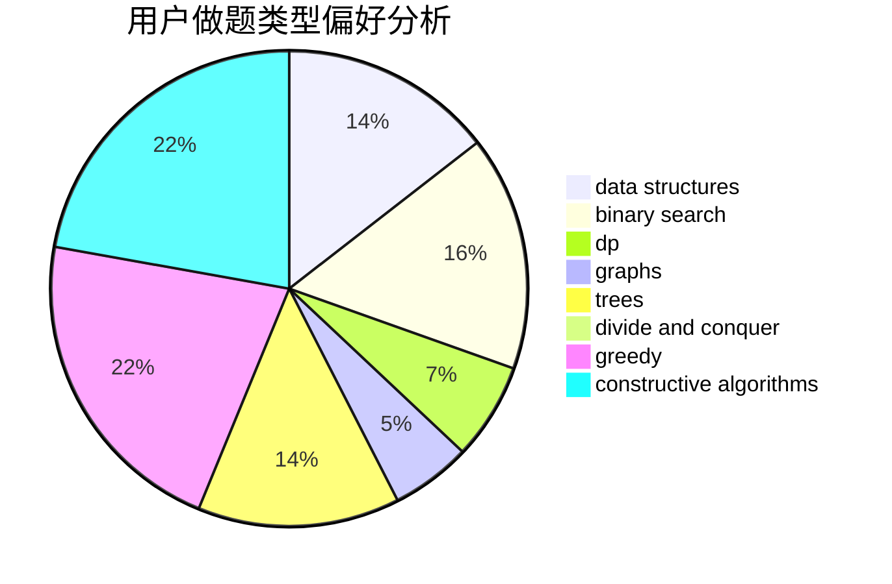
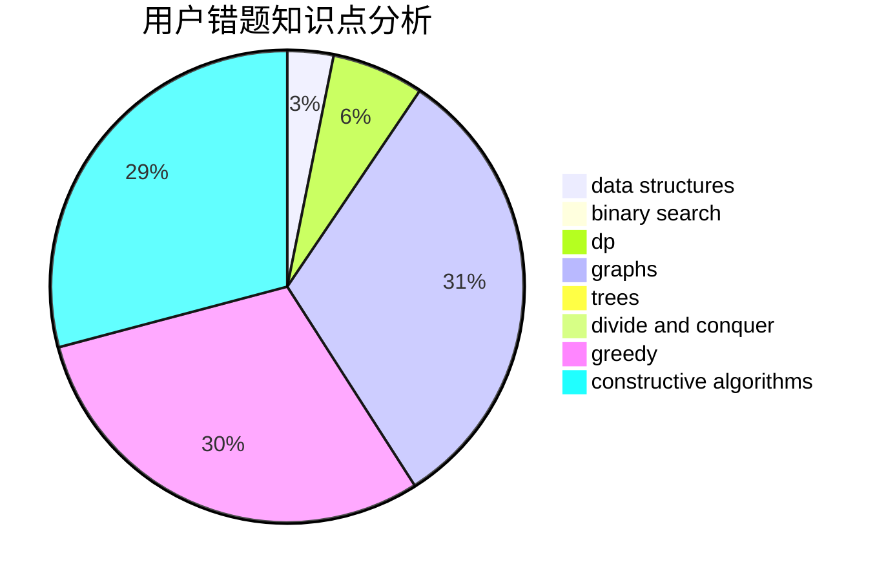

# xiaobuxie

<!-- tabs:start -->

#### **用户提交结果分析**

#### **用户做题类型偏好分析**

#### **用户错题知识点分析**

<!-- tabs:end -->
# 推荐题目
[598B](https://codeforces.com/contest/598/problem/B)		implementation,
                        strings		  
[841B](https://codeforces.com/contest/841/problem/B)		games,
                        math		  
[499C](https://codeforces.com/contest/499/problem/C)		dsu,graphs,sortings,trees		  
[978A](https://codeforces.com/contest/978/problem/A)		implementation		  
[667A](https://codeforces.com/contest/667/problem/A)		geometry,
                        math		  
[1332F](https://codeforces.com/contest/1332/problem/F)		dfs and similar,
                        dp,
                        trees		  
[1371A](https://codeforces.com/contest/1371/problem/A)		math		  
[1282B2](https://codeforces.com/contest/1282B/problem/2)		dp,
                        greedy,
                        sortings		  
[1007E](https://codeforces.com/contest/1007/problem/E)		dp		  
[112A](https://codeforces.com/contest/112/problem/A)		implementation,
                        strings		  
