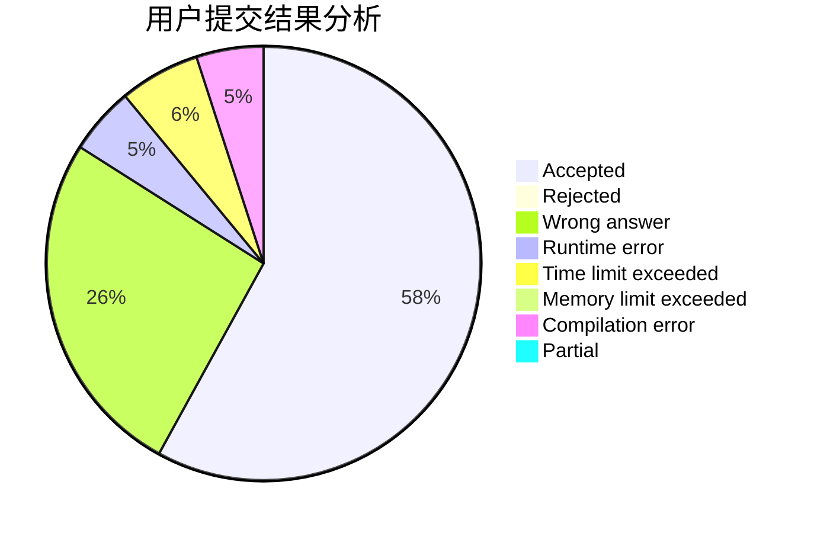
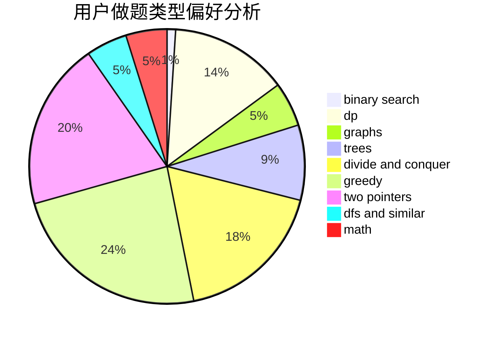

# xiaobuxie

<!-- tabs:start -->

#### **用户提交结果分析**

#### **用户做题类型偏好分析**

<!-- tabs:end -->
# 推荐题目
[616A](https://codeforces.com/contest/616/problem/A)
[860B](https://codeforces.com/contest/860/problem/B)
[51A](https://codeforces.com/contest/51/problem/A)
[991E](https://codeforces.com/contest/991/problem/E)
[689A](https://codeforces.com/contest/689/problem/A)
[1339C](https://codeforces.com/contest/1339/problem/C)
[1379E](https://codeforces.com/contest/1379/problem/E)
[1288E](https://codeforces.com/contest/1288/problem/E)
[1008C](https://codeforces.com/contest/1008/problem/C)
[1131F](https://codeforces.com/contest/1131/problem/F)
