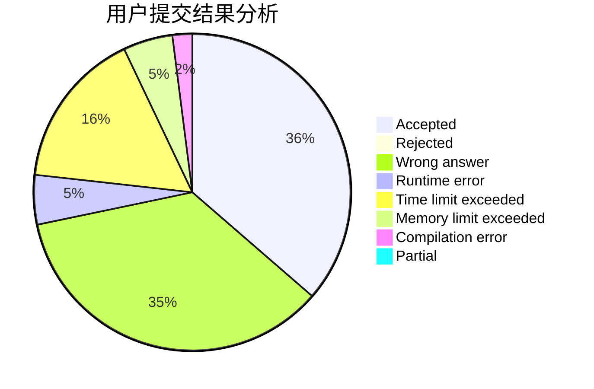
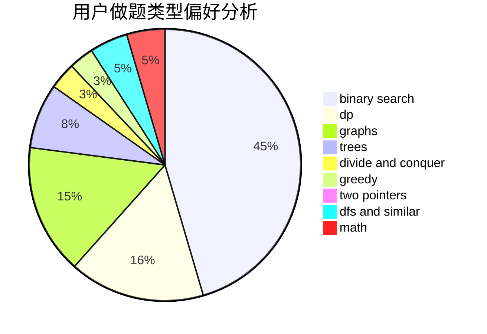

# xiaofan7

<!-- tabs:start -->

#### **用户提交结果分析**

#### **用户做题类型偏好分析**

<!-- tabs:end -->
# 推荐题目
[869B](https://codeforces.com/contest/869/problem/B)
[1399F](https://codeforces.com/contest/1399/problem/F)
[519D](https://codeforces.com/contest/519/problem/D)
[459C](https://codeforces.com/contest/459/problem/C)
[577E](https://codeforces.com/contest/577/problem/E)
[516B](https://codeforces.com/contest/516/problem/B)
[138C](https://codeforces.com/contest/138/problem/C)
[610D](https://codeforces.com/contest/610/problem/D)
[117A](https://codeforces.com/contest/117/problem/A)
[609A](https://codeforces.com/contest/609/problem/A)
