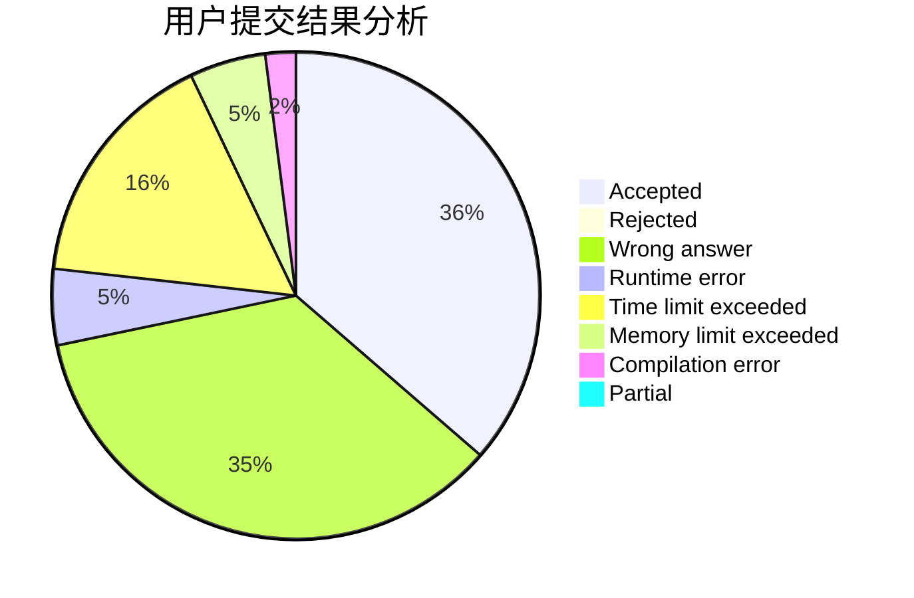
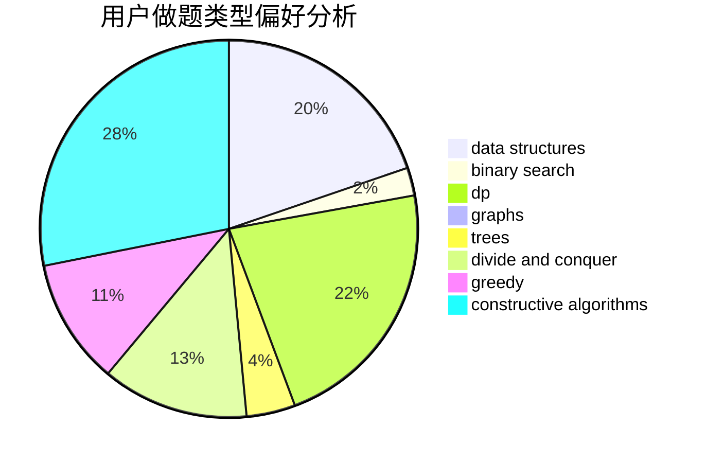

# xiaofan7

<!-- tabs:start -->

#### **用户提交结果分析**

#### **用户做题类型偏好分析**

#### **用户错题知识点分析**

<!-- tabs:end -->
# 推荐题目
[850C](https://codeforces.com/contest/850/problem/C)		bitmasks,
                        dp,
                        games		  
[1391B](https://codeforces.com/contest/1391/problem/B)		brute force,
                        greedy,
                        implementation		  
[498D](https://codeforces.com/contest/498/problem/D)		data structures,
                        dp,
                        number theory		  
[437A](https://codeforces.com/contest/437/problem/A)		implementation		  
[552C](https://codeforces.com/contest/552/problem/C)		brute force,
                        dp,
                        greedy,
                        math,
                        meet-in-the-middle,
                        number theory		  
[497A](https://codeforces.com/contest/497/problem/A)		dsu,graphs,sortings,trees		  
[1380E](https://codeforces.com/contest/1380/problem/E)		data structures,
                        dsu,
                        implementation,
                        trees		  
[591A](https://codeforces.com/contest/591/problem/A)		implementation,
                        math		  
[1176D](https://codeforces.com/contest/1176/problem/D)		dfs and similar,
                        graphs,
                        greedy,
                        number theory,
                        sortings		  
[588C](https://codeforces.com/contest/588/problem/C)		dsu,graphs,sortings,trees		  
