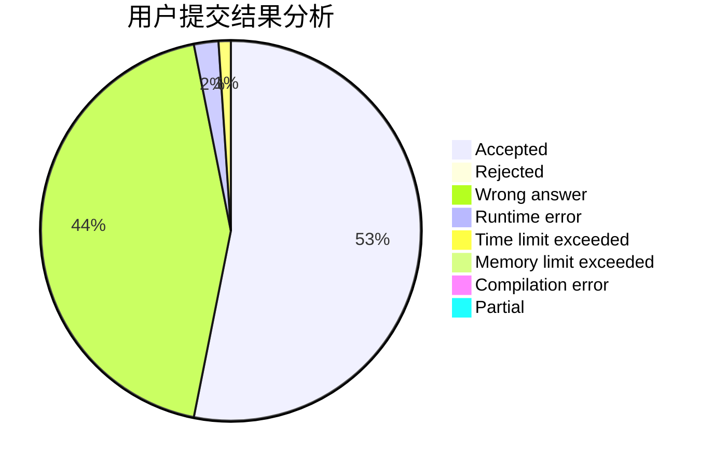
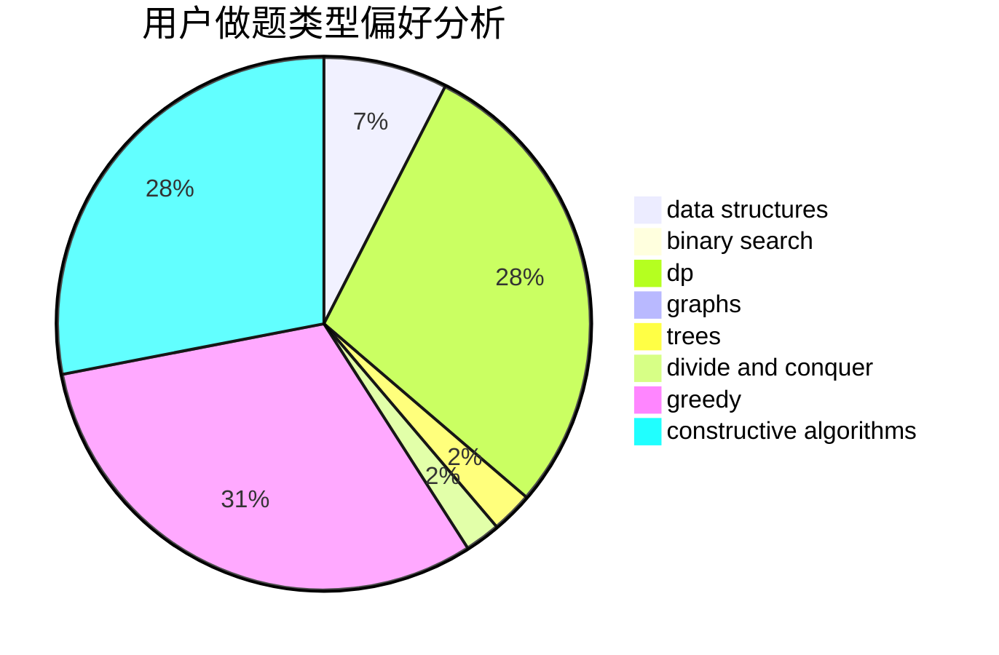
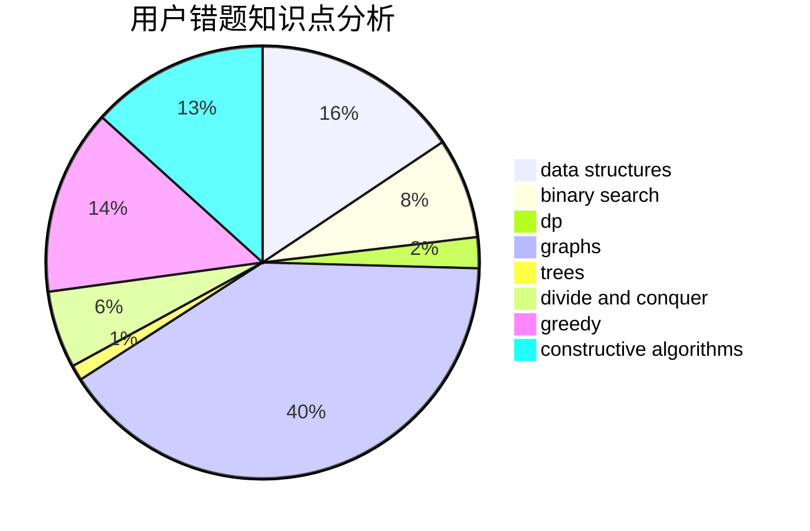

# xiaok

<!-- tabs:start -->

#### **用户提交结果分析**

#### **用户做题类型偏好分析**

#### **用户错题知识点分析**

<!-- tabs:end -->
# 推荐题目
[1327A](https://codeforces.com/contest/1327/problem/A)		math		  
[789A](https://codeforces.com/contest/789/problem/A)		implementation,
                        math		  
[639D](https://codeforces.com/contest/639/problem/D)		data structures,
                        greedy,
                        sortings,
                        two pointers		  
[555C](https://codeforces.com/contest/555/problem/C)		data structures		  
[305D](https://codeforces.com/contest/305/problem/D)		combinatorics,
                        math		  
[821D](https://codeforces.com/contest/821/problem/D)		dfs and similar,
                        graphs,
                        shortest paths		  
[676C](https://codeforces.com/contest/676/problem/C)		binary search,
                        dp,
                        strings,
                        two pointers		  
[1240B](https://codeforces.com/contest/1240/problem/B)		dsu,graphs,sortings,trees		  
[484B](https://codeforces.com/contest/484/problem/B)		binary search,
                        math,
                        sortings,
                        two pointers		  
[444E](https://codeforces.com/contest/444/problem/E)		binary search,
                        dsu,
                        trees		  
