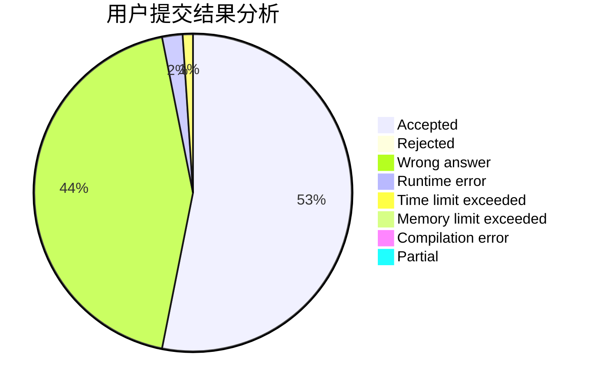
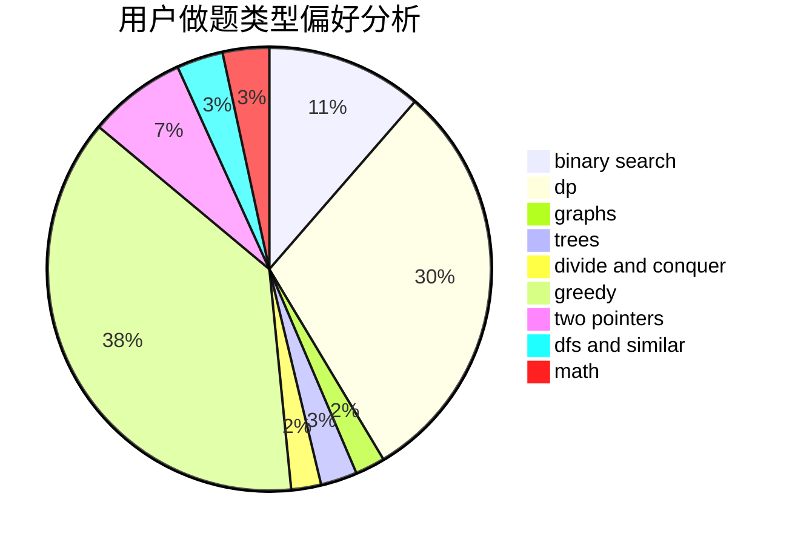

# xiaok

<!-- tabs:start -->

#### **用户提交结果分析**

#### **用户做题类型偏好分析**

<!-- tabs:end -->
# 推荐题目
[1327A](https://codeforces.com/contest/1327/problem/A)
[789A](https://codeforces.com/contest/789/problem/A)
[639D](https://codeforces.com/contest/639/problem/D)
[555C](https://codeforces.com/contest/555/problem/C)
[305D](https://codeforces.com/contest/305/problem/D)
[821D](https://codeforces.com/contest/821/problem/D)
[676C](https://codeforces.com/contest/676/problem/C)
[1240B](https://codeforces.com/contest/1240/problem/B)
[484B](https://codeforces.com/contest/484/problem/B)
[444E](https://codeforces.com/contest/444/problem/E)
