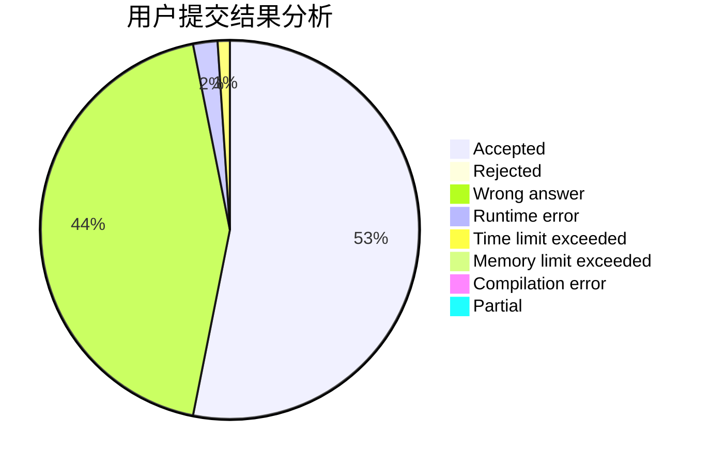
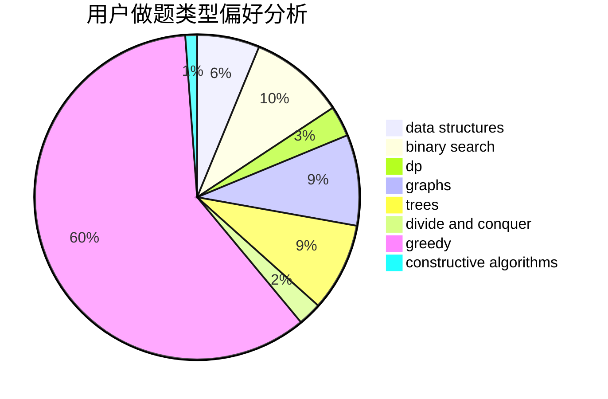
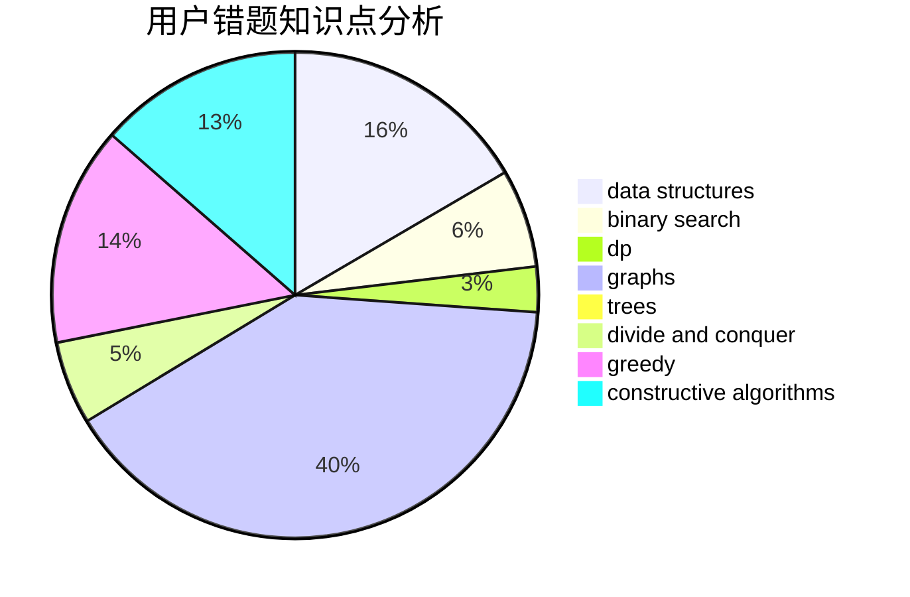

# xiaok

<!-- tabs:start -->

#### **用户提交结果分析**

#### **用户做题类型偏好分析**

#### **用户错题知识点分析**

<!-- tabs:end -->
# 推荐题目
[1320A](https://codeforces.com/contest/1320/problem/A)		data structures,
                        dp,
                        greedy,
                        math,
                        sortings		  
[769A](https://codeforces.com/contest/769/problem/A)		*special problem,
                        implementation,
                        sortings		  
[618E](https://codeforces.com/contest/618/problem/E)		data structures,
                        geometry		  
[533E](https://codeforces.com/contest/533/problem/E)		constructive algorithms,
                        dp,
                        greedy,
                        hashing,
                        strings,
                        two pointers		  
[291A](https://codeforces.com/contest/291/problem/A)		*special problem,
                        implementation,
                        sortings		  
[805C](https://codeforces.com/contest/805/problem/C)		dsu,graphs,sortings,trees		  
[652D](https://codeforces.com/contest/652/problem/D)		data structures,
                        sortings		  
[1234E](https://codeforces.com/contest/1234/problem/E)		math		  
[464C](https://codeforces.com/contest/464/problem/C)		dp		  
[41A](https://codeforces.com/contest/41/problem/A)		implementation,
                        strings		  
