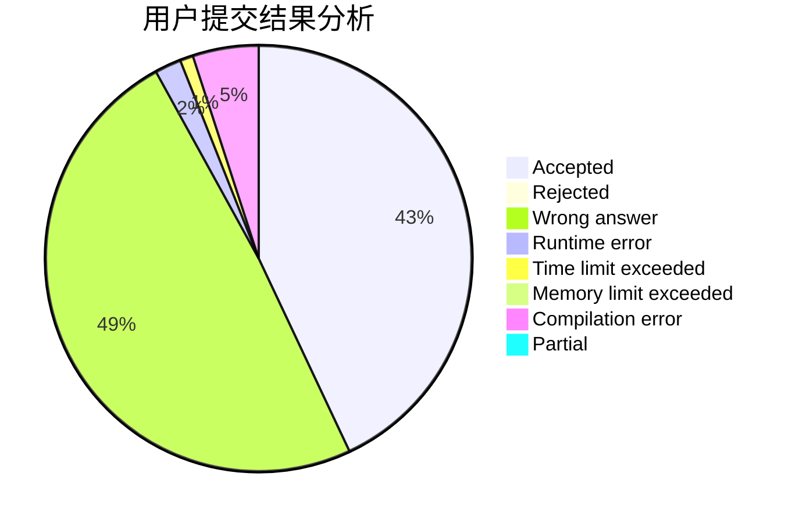
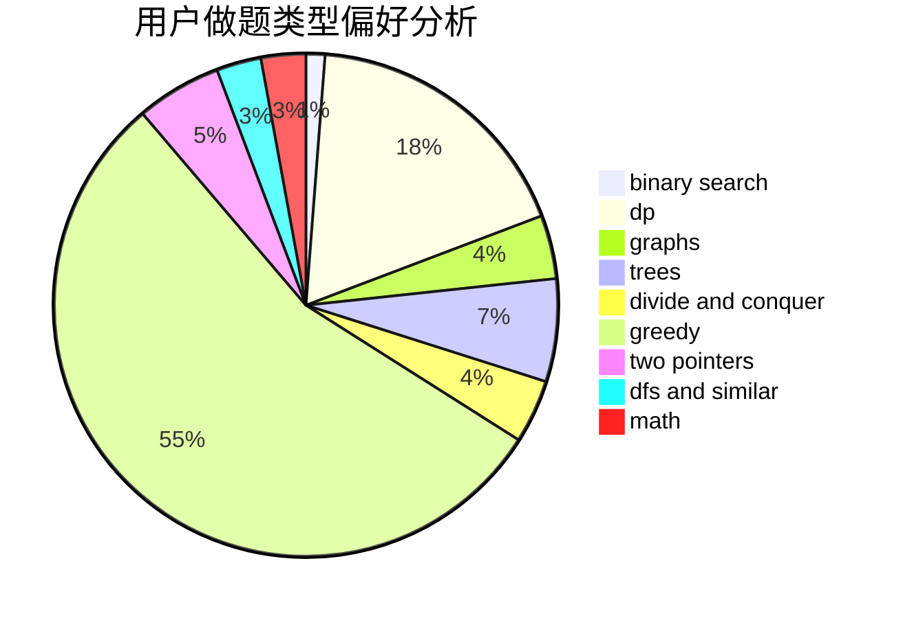

# xiaolou0411

<!-- tabs:start -->

#### **用户提交结果分析**

#### **用户做题类型偏好分析**

<!-- tabs:end -->
# 推荐题目
[1446E](https://codeforces.com/contest/1446/problem/E)
[1200D](https://codeforces.com/contest/1200/problem/D)
[348B](https://codeforces.com/contest/348/problem/B)
[1339C](https://codeforces.com/contest/1339/problem/C)
[1290A](https://codeforces.com/contest/1290/problem/A)
[1340B](https://codeforces.com/contest/1340/problem/B)
[1350E](https://codeforces.com/contest/1350/problem/E)
[229D](https://codeforces.com/contest/229/problem/D)
[681B](https://codeforces.com/contest/681/problem/B)
[845D](https://codeforces.com/contest/845/problem/D)
