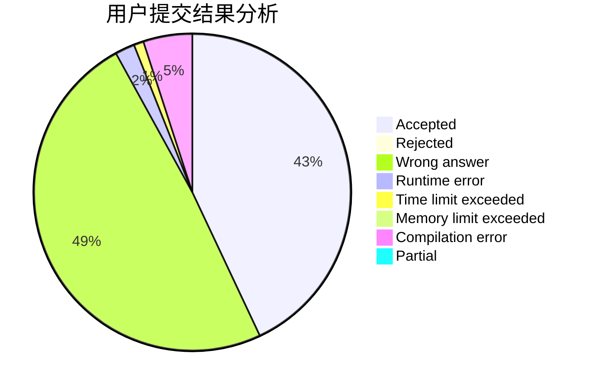
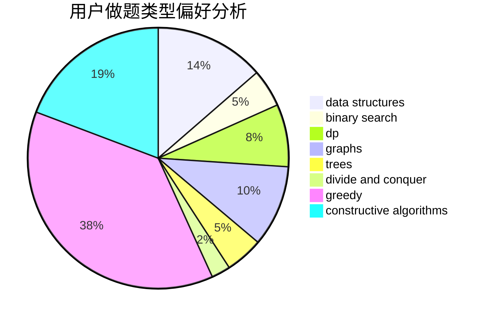
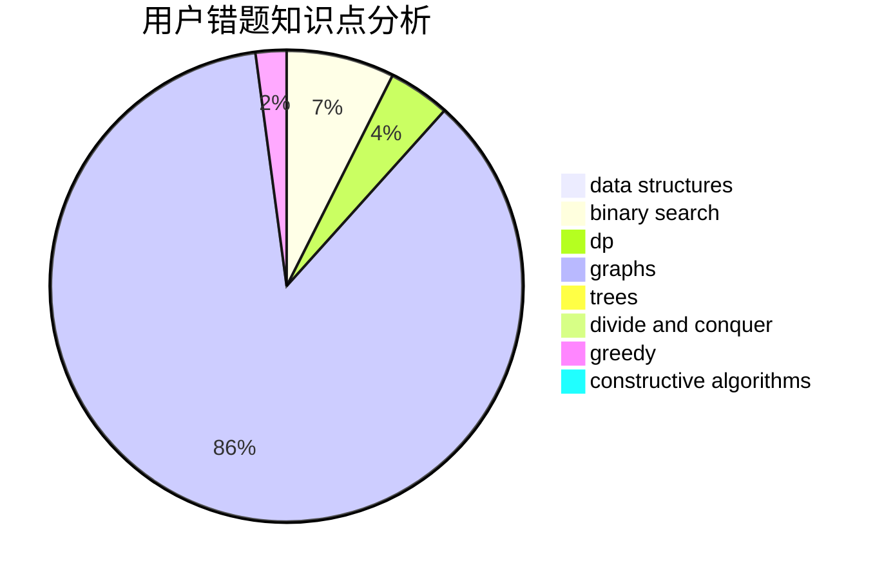

# xiaolou0411

<!-- tabs:start -->

#### **用户提交结果分析**

#### **用户做题类型偏好分析**

#### **用户错题知识点分析**

<!-- tabs:end -->
# 推荐题目
[1436F](https://codeforces.com/contest/1436/problem/F)		combinatorics,
                        math,
                        number theory		  
[1197B](https://codeforces.com/contest/1197/problem/B)		greedy,
                        implementation		  
[318A](https://codeforces.com/contest/318/problem/A)		math		  
[1332F](https://codeforces.com/contest/1332/problem/F)		dfs and similar,
                        dp,
                        trees		  
[1283A](https://codeforces.com/contest/1283/problem/A)		math		  
[1333C](https://codeforces.com/contest/1333/problem/C)		binary search,
                        data structures,
                        implementation,
                        two pointers		  
[1344A](https://codeforces.com/contest/1344/problem/A)		math,
                        number theory,
                        sortings		  
[205B](https://codeforces.com/contest/205/problem/B)		brute force,
                        greedy		  
[660D](https://codeforces.com/contest/660/problem/D)		geometry		  
[827A](https://codeforces.com/contest/827/problem/A)		data structures,
                        greedy,
                        sortings,
                        strings		  
