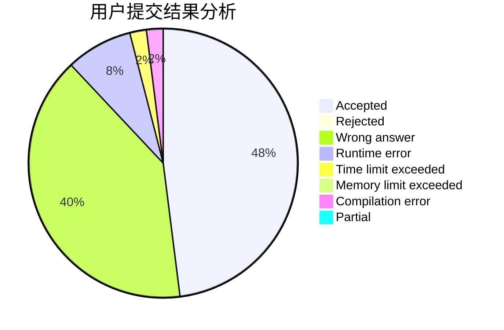
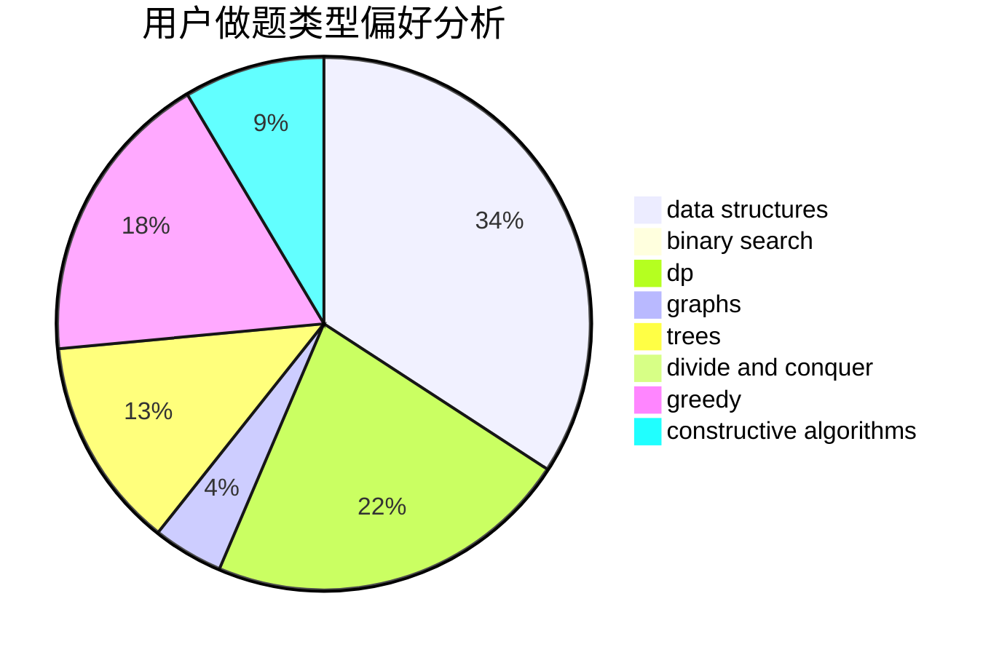
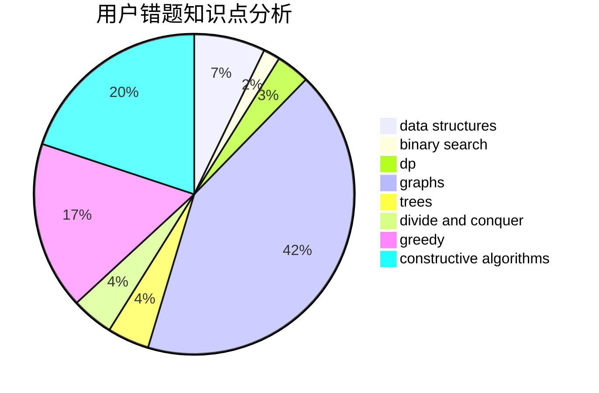

# xiaoyinzei

<!-- tabs:start -->

#### **用户提交结果分析**

#### **用户做题类型偏好分析**

#### **用户错题知识点分析**

<!-- tabs:end -->
# 推荐题目
[13561](https://codeforces.com/contest/1356/problem/1)		dsu,graphs,sortings,trees		  
[190E](https://codeforces.com/contest/190/problem/E)		data structures,
                        dsu,
                        graphs,
                        hashing,
                        sortings		  
[198C](https://codeforces.com/contest/198/problem/C)		binary search,
                        geometry		  
[788E](https://codeforces.com/contest/788/problem/E)		data structures		  
[957B](https://codeforces.com/contest/957/problem/B)		dsu,graphs,sortings,trees		  
[918C](https://codeforces.com/contest/918/problem/C)		dsu,graphs,sortings,trees		  
[1070I](https://codeforces.com/contest/1070/problem/I)		flows,
                        graph matchings,
                        graphs		  
[518B](https://codeforces.com/contest/518/problem/B)		greedy,
                        implementation,
                        strings		  
[597C](https://codeforces.com/contest/597/problem/C)		data structures,
                        dp		  
[225C](https://codeforces.com/contest/225/problem/C)		dp,
                        matrices		  
