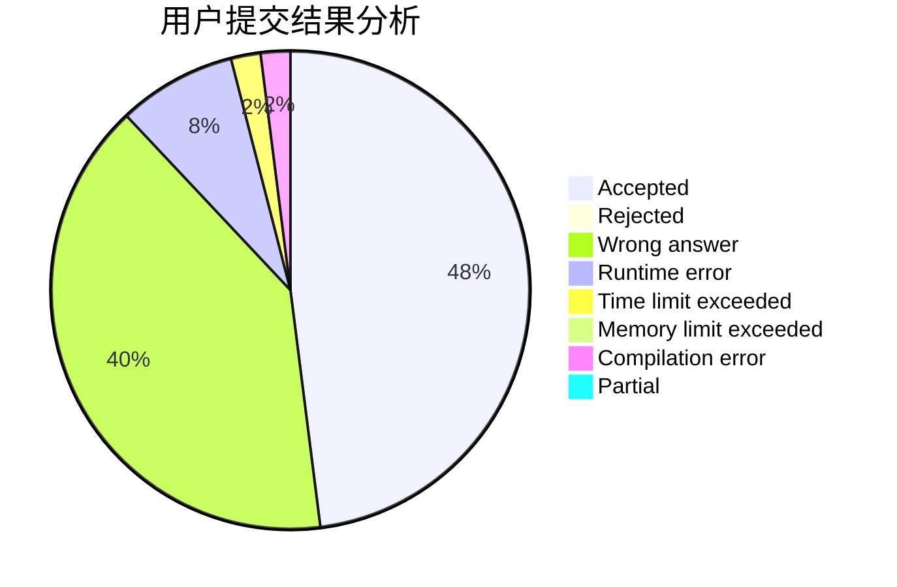
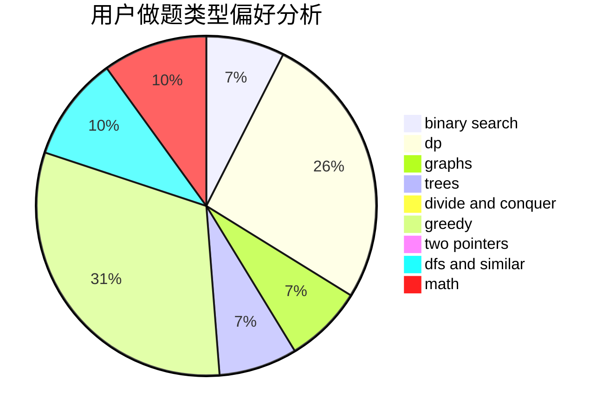

# xiaoyinzei

<!-- tabs:start -->

#### **用户提交结果分析**

#### **用户做题类型偏好分析**

<!-- tabs:end -->
# 推荐题目
[13561](https://codeforces.com/contest/1356/problem/1)
[190E](https://codeforces.com/contest/190/problem/E)
[198C](https://codeforces.com/contest/198/problem/C)
[788E](https://codeforces.com/contest/788/problem/E)
[957B](https://codeforces.com/contest/957/problem/B)
[918C](https://codeforces.com/contest/918/problem/C)
[1070I](https://codeforces.com/contest/1070/problem/I)
[518B](https://codeforces.com/contest/518/problem/B)
[597C](https://codeforces.com/contest/597/problem/C)
[225C](https://codeforces.com/contest/225/problem/C)
