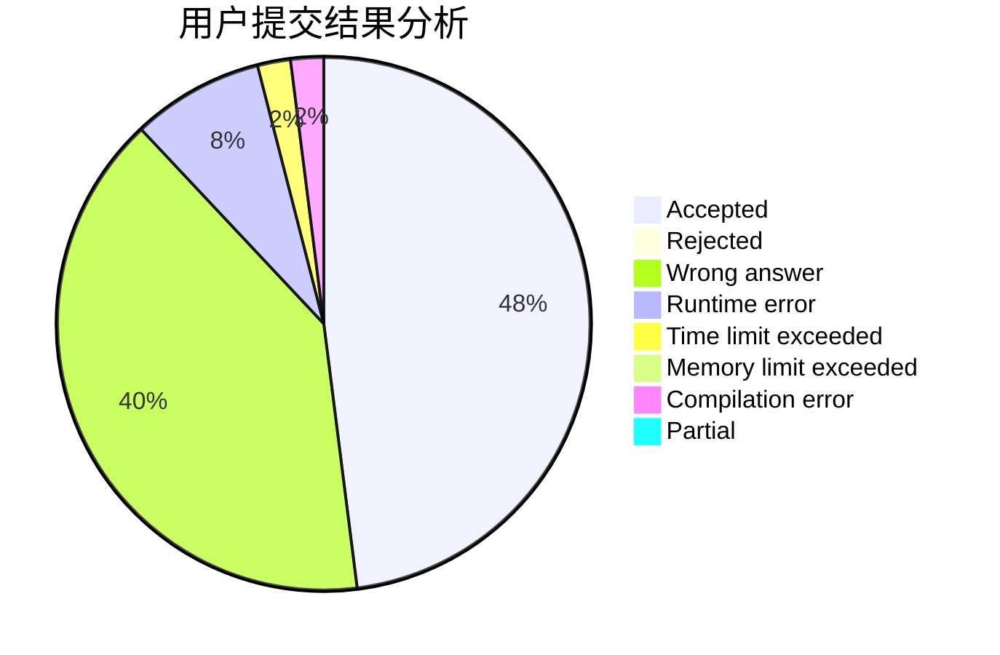
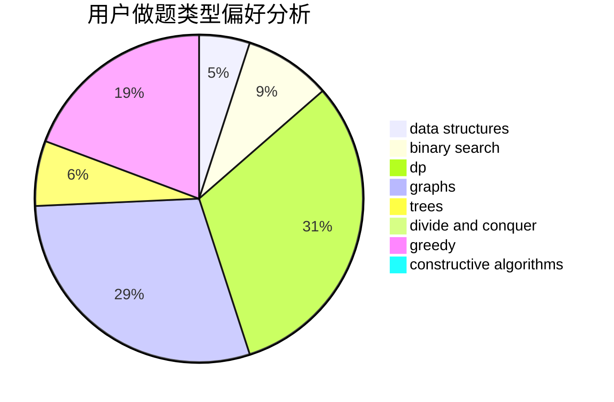
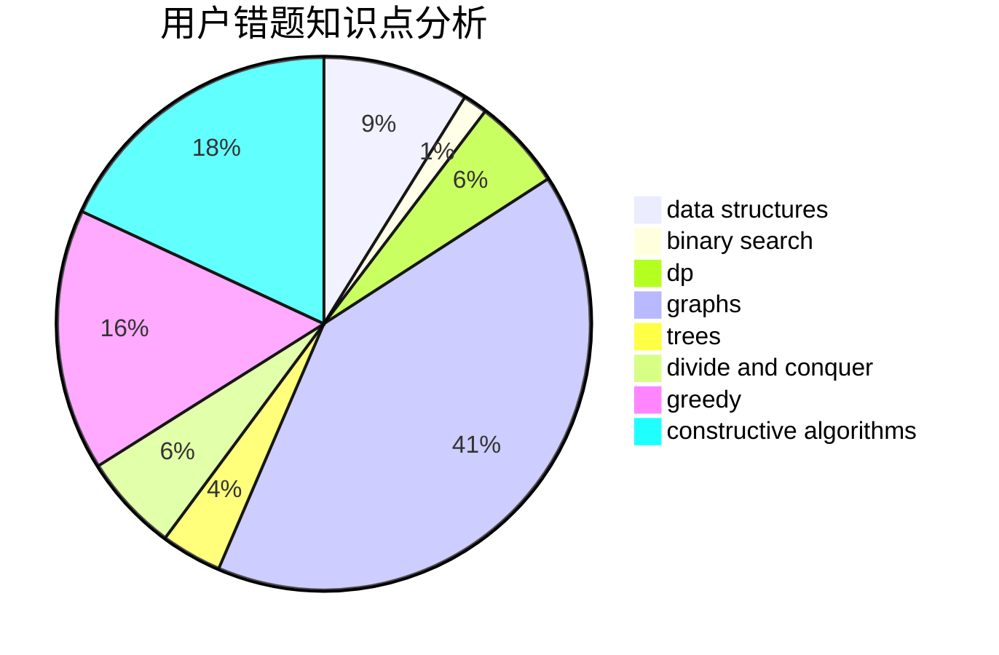

# xiaoyinzei

<!-- tabs:start -->

#### **用户提交结果分析**

#### **用户做题类型偏好分析**

#### **用户错题知识点分析**

<!-- tabs:end -->
# 推荐题目
[1349C](https://codeforces.com/contest/1349/problem/C)		dfs and similar,
                        graphs,
                        implementation,
                        shortest paths		  
[165E](https://codeforces.com/contest/165/problem/E)		bitmasks,
                        brute force,
                        dfs and similar,
                        dp		  
[171C](https://codeforces.com/contest/171/problem/C)		*special problem,
                        implementation		  
[768G](https://codeforces.com/contest/768/problem/G)		binary search,
                        data structures		  
[935C](https://codeforces.com/contest/935/problem/C)		geometry		  
[902A](https://codeforces.com/contest/902/problem/A)		greedy,
                        implementation		  
[1070F](https://codeforces.com/contest/1070/problem/F)		greedy		  
[497E](https://codeforces.com/contest/497/problem/E)		dp,
                        matrices		  
[575H](https://codeforces.com/contest/575/problem/H)		combinatorics,
                        number theory		  
[200A](https://codeforces.com/contest/200/problem/A)		brute force,
                        data structures		  
