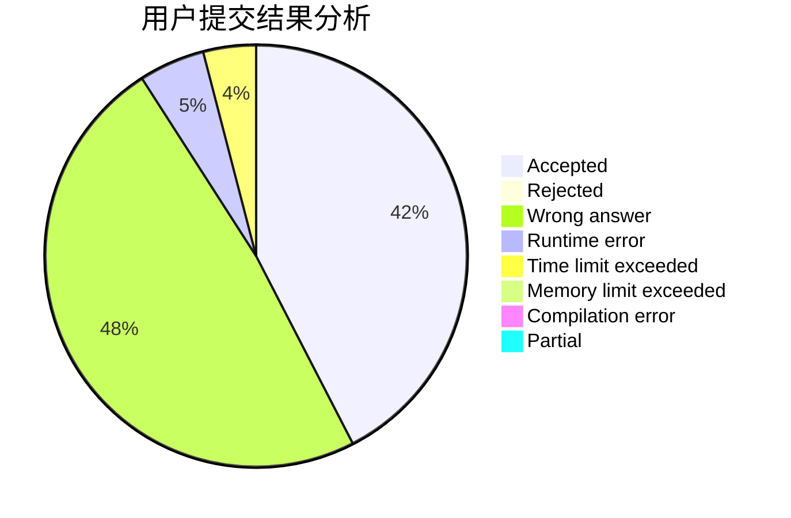
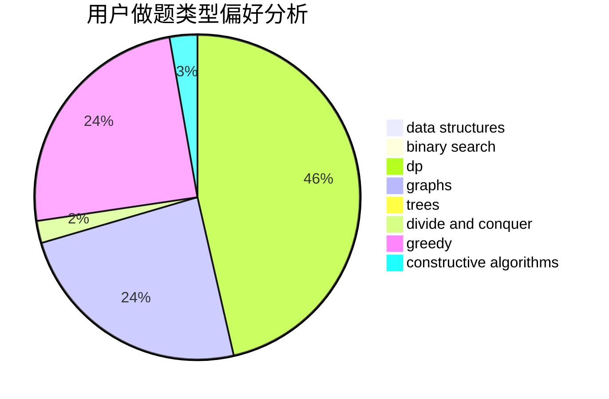

# xiejun

<!-- tabs:start -->

#### **用户提交结果分析**

#### **用户做题类型偏好分析**

#### **用户错题知识点分析**

<!-- tabs:end -->
# 推荐题目
[1183A](https://codeforces.com/contest/1183/problem/A)		implementation		  
[560E](https://codeforces.com/contest/560/problem/E)		dsu,graphs,sortings,trees		  
[821C](https://codeforces.com/contest/821/problem/C)		data structures,
                        greedy,
                        trees		  
[472B](https://codeforces.com/contest/472/problem/B)		nan		  
[10022](https://codeforces.com/contest/1002/problem/2)		dsu,graphs,sortings,trees		  
[484E](https://codeforces.com/contest/484/problem/E)		binary search,
                        constructive algorithms,
                        data structures		  
[608C](https://codeforces.com/contest/608/problem/C)		dsu,graphs,sortings,trees		  
[699A](https://codeforces.com/contest/699/problem/A)		implementation		  
[803B](https://codeforces.com/contest/803/problem/B)		constructive algorithms		  
[845A](https://codeforces.com/contest/845/problem/A)		implementation,
                        sortings		  
