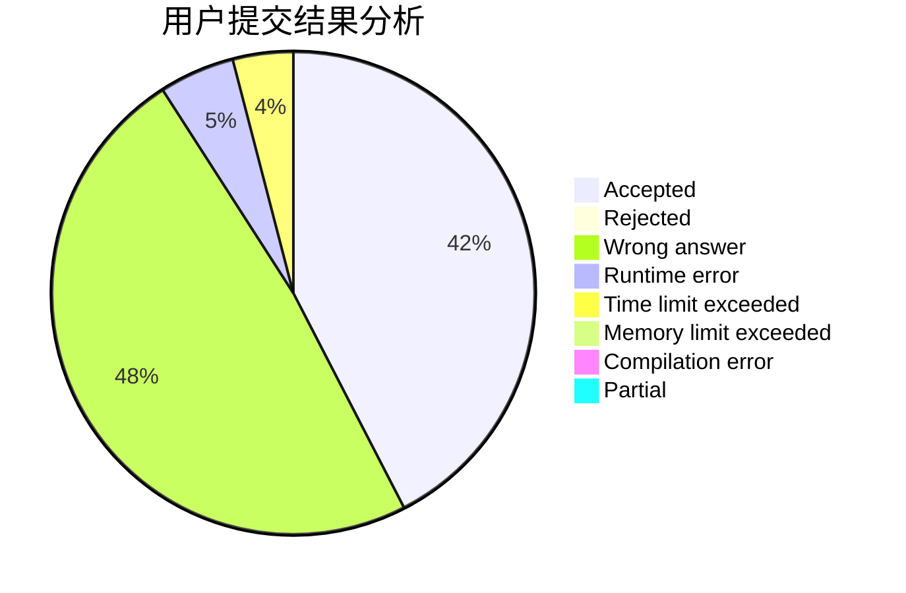
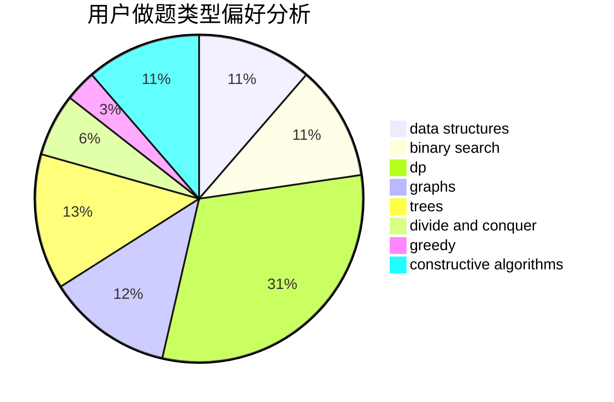

# xiejun

<!-- tabs:start -->

#### **用户提交结果分析**

#### **用户做题类型偏好分析**

#### **用户错题知识点分析**

<!-- tabs:end -->
# 推荐题目
[117E](https://codeforces.com/contest/117/problem/E)		data structures,
                        divide and conquer,
                        implementation,
                        trees		  
[53E](https://codeforces.com/contest/53/problem/E)		bitmasks,
                        dp		  
[805B](https://codeforces.com/contest/805/problem/B)		constructive algorithms		  
[44I](https://codeforces.com/contest/44/problem/I)		brute force,
                        combinatorics		  
[1002A4](https://codeforces.com/contest/1002A/problem/4)		nan		  
[465D](https://codeforces.com/contest/465/problem/D)		dsu,graphs,sortings,trees		  
[588A](https://codeforces.com/contest/588/problem/A)		greedy		  
[673B](https://codeforces.com/contest/673/problem/B)		greedy,
                        implementation		  
[787A](https://codeforces.com/contest/787/problem/A)		brute force,
                        math,
                        number theory		  
[825E](https://codeforces.com/contest/825/problem/E)		data structures,
                        dfs and similar,
                        graphs,
                        greedy		  
