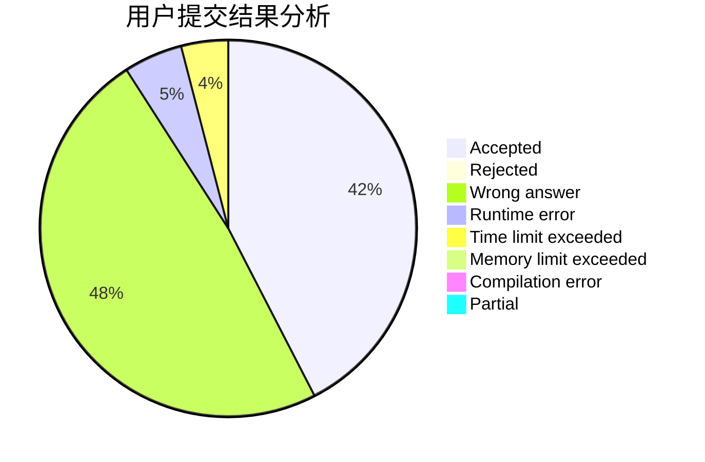
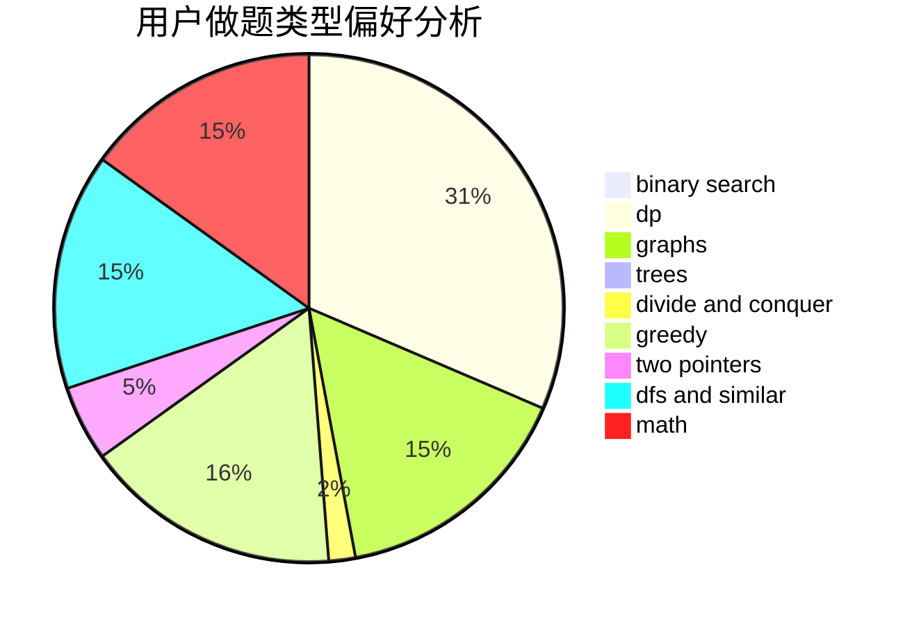

# xiejun

<!-- tabs:start -->

#### **用户提交结果分析**

#### **用户做题类型偏好分析**

<!-- tabs:end -->
# 推荐题目
[1183A](https://codeforces.com/contest/1183/problem/A)
[560E](https://codeforces.com/contest/560/problem/E)
[821C](https://codeforces.com/contest/821/problem/C)
[472B](https://codeforces.com/contest/472/problem/B)
[10022](https://codeforces.com/contest/1002/problem/2)
[484E](https://codeforces.com/contest/484/problem/E)
[608C](https://codeforces.com/contest/608/problem/C)
[699A](https://codeforces.com/contest/699/problem/A)
[803B](https://codeforces.com/contest/803/problem/B)
[845A](https://codeforces.com/contest/845/problem/A)
