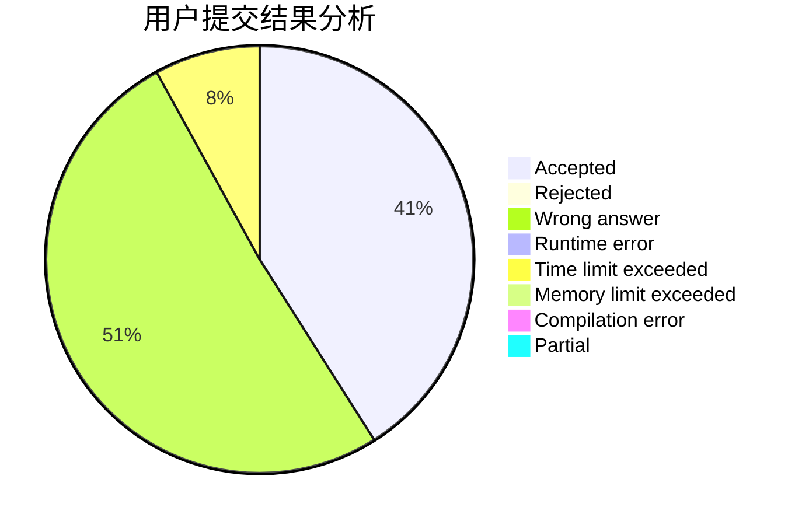
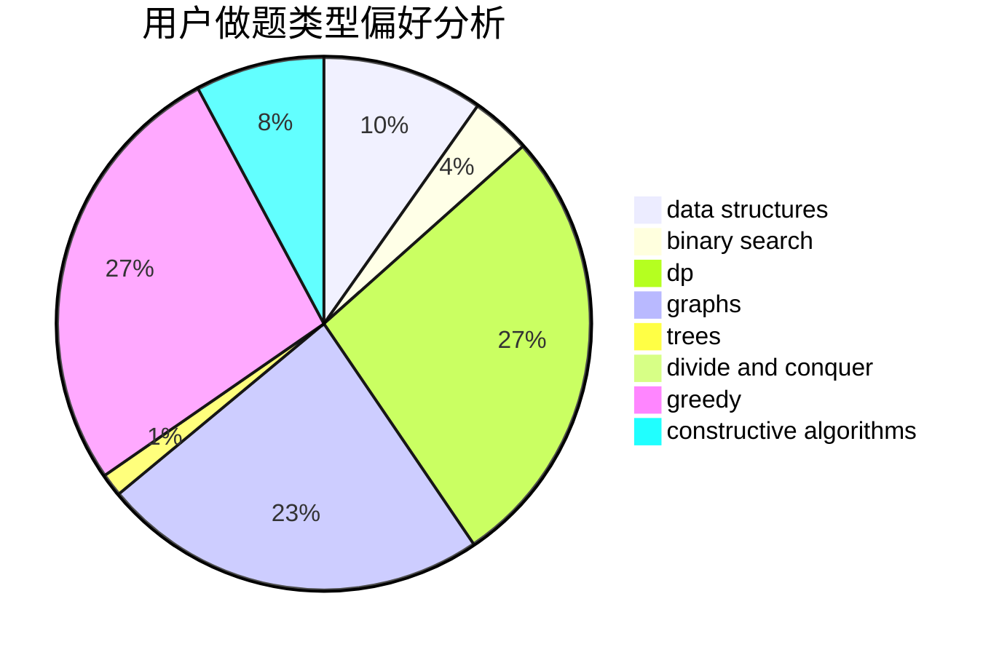

# CaoAnda

<!-- tabs:start -->

#### **用户提交结果分析**

#### **用户做题类型偏好分析**

#### **用户错题知识点分析**

<!-- tabs:end -->
# 推荐题目
[645E](https://codeforces.com/contest/645/problem/E)		dp,
                        greedy,
                        strings		  
[645G](https://codeforces.com/contest/645/problem/G)		binary search,
                        geometry		  
[364D](https://codeforces.com/contest/364/problem/D)		brute force,
                        math,
                        probabilities		  
[645F](https://codeforces.com/contest/645/problem/F)		combinatorics,
                        math,
                        number theory		  
[1066C](https://codeforces.com/contest/1066/problem/C)		implementation		  
[1312D](https://codeforces.com/contest/1312/problem/D)		combinatorics,
                        math		  
[1109B](https://codeforces.com/contest/1109/problem/B)		constructive algorithms,
                        hashing,
                        strings		  
[1209C](https://codeforces.com/contest/1209/problem/C)		constructive algorithms,
                        greedy,
                        implementation		  
[369B](https://codeforces.com/contest/369/problem/B)		constructive algorithms,
                        implementation,
                        math		  
[41A](https://codeforces.com/contest/41/problem/A)		implementation,
                        strings		  
