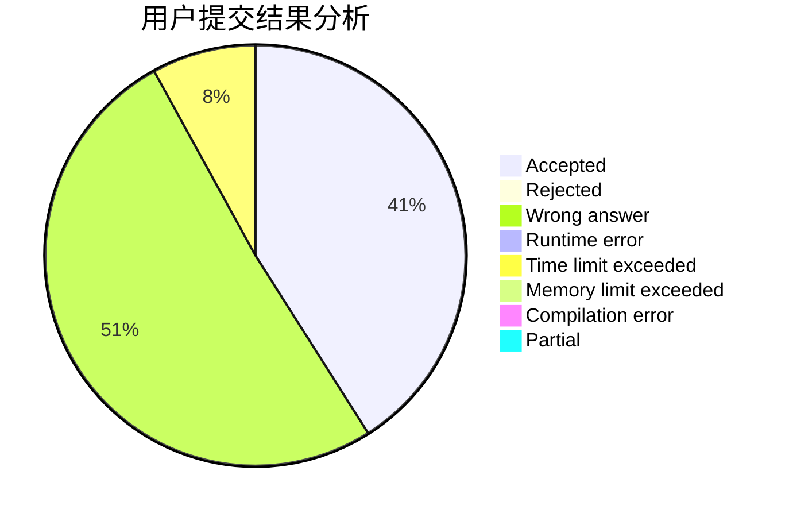
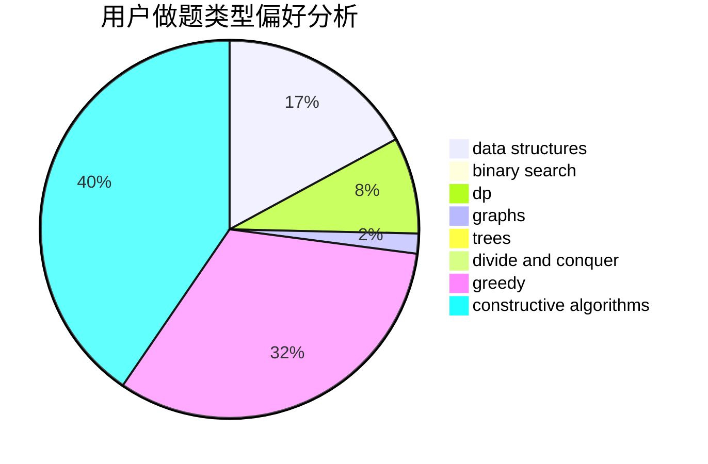
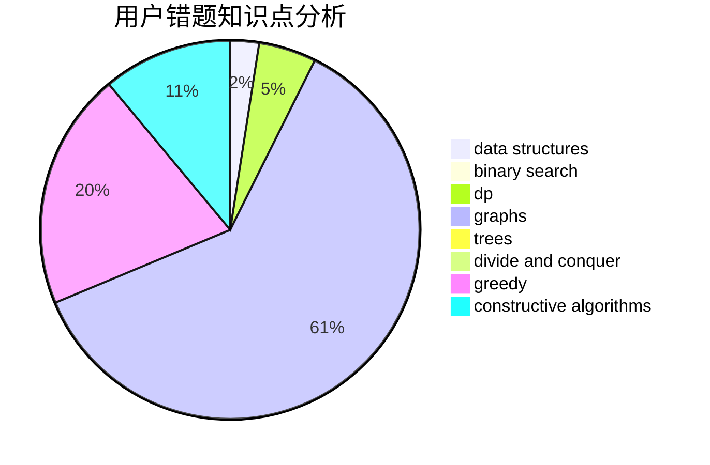

# CaoAnda

<!-- tabs:start -->

#### **用户提交结果分析**

#### **用户做题类型偏好分析**

#### **用户错题知识点分析**

<!-- tabs:end -->
# 推荐题目
[672A](https://codeforces.com/contest/672/problem/A)		implementation		  
[672C](https://codeforces.com/contest/672/problem/C)		dsu,graphs,sortings,trees		  
[392A](https://codeforces.com/contest/392/problem/A)		math		  
[672B](https://codeforces.com/contest/672/problem/B)		constructive algorithms,
                        implementation,
                        strings		  
[1066F](https://codeforces.com/contest/1066/problem/F)		dp		  
[1321F](https://codeforces.com/contest/1321/problem/F)		dsu,graphs,sortings,trees		  
[1109F](https://codeforces.com/contest/1109/problem/F)		data structures,
                        trees		  
[1214G](https://codeforces.com/contest/1214/problem/G)		bitmasks,
                        data structures		  
[39D](https://codeforces.com/contest/39/problem/D)		math		  
[444E](https://codeforces.com/contest/444/problem/E)		binary search,
                        dsu,
                        trees		  
