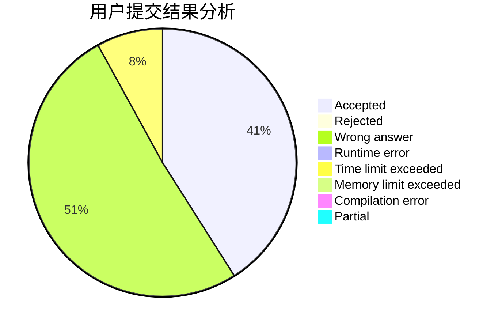
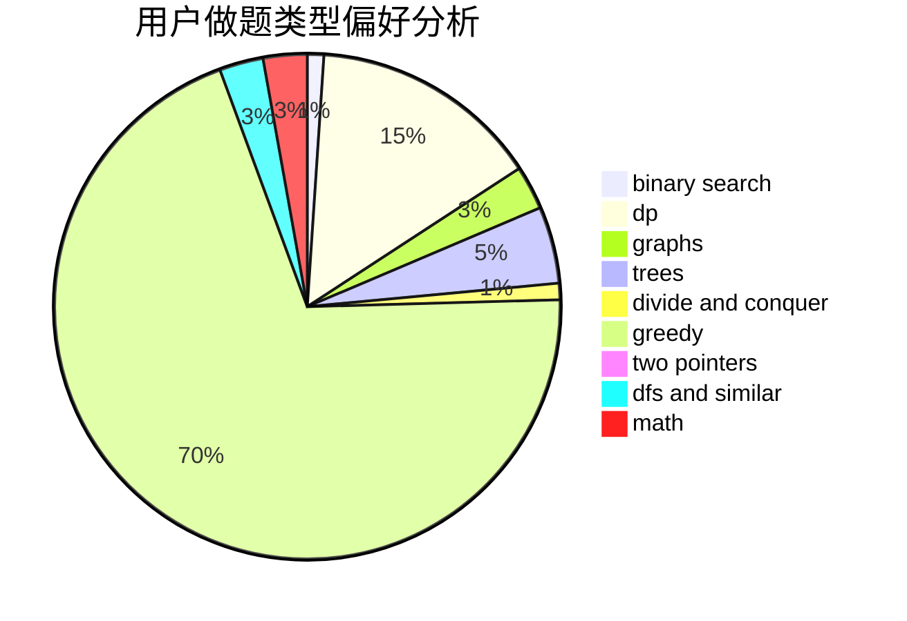

# CaoAnda

<!-- tabs:start -->

#### **用户提交结果分析**

#### **用户做题类型偏好分析**

<!-- tabs:end -->
# 推荐题目
[672A](https://codeforces.com/contest/672/problem/A)
[672C](https://codeforces.com/contest/672/problem/C)
[392A](https://codeforces.com/contest/392/problem/A)
[672B](https://codeforces.com/contest/672/problem/B)
[1066F](https://codeforces.com/contest/1066/problem/F)
[1321F](https://codeforces.com/contest/1321/problem/F)
[1109F](https://codeforces.com/contest/1109/problem/F)
[1214G](https://codeforces.com/contest/1214/problem/G)
[39D](https://codeforces.com/contest/39/problem/D)
[444E](https://codeforces.com/contest/444/problem/E)
