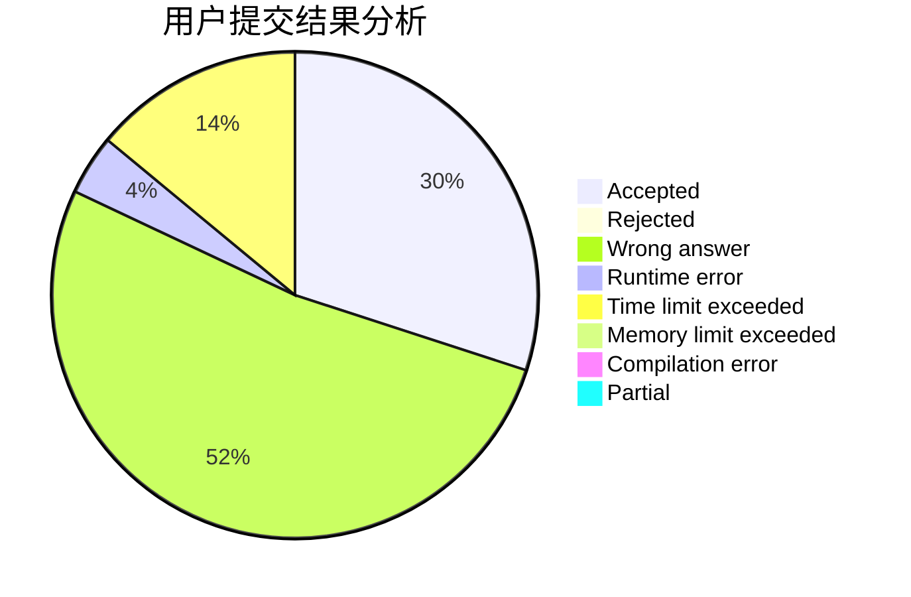
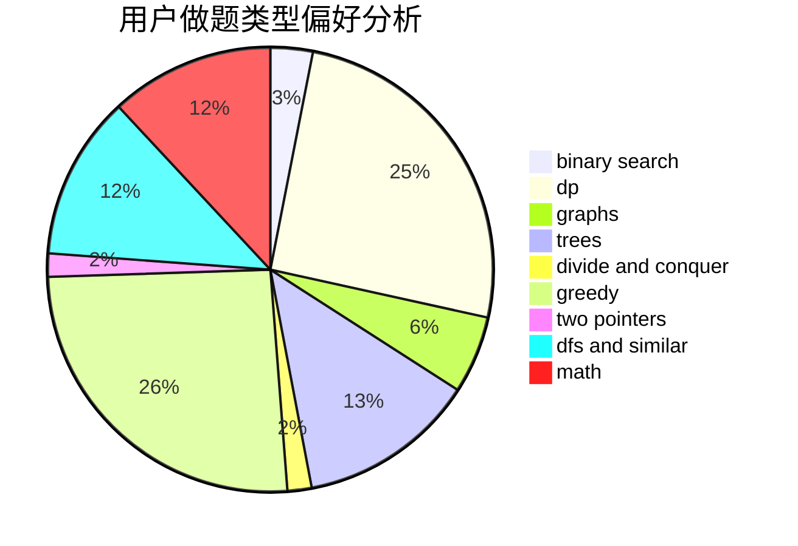

# xin_chen

<!-- tabs:start -->

#### **用户提交结果分析**

#### **用户做题类型偏好分析**

<!-- tabs:end -->
# 推荐题目
[220C](https://codeforces.com/contest/220/problem/C)
[47B](https://codeforces.com/contest/47/problem/B)
[576C](https://codeforces.com/contest/576/problem/C)
[580B](https://codeforces.com/contest/580/problem/B)
[835C](https://codeforces.com/contest/835/problem/C)
[1093G](https://codeforces.com/contest/1093/problem/G)
[1030C](https://codeforces.com/contest/1030/problem/C)
[865A](https://codeforces.com/contest/865/problem/A)
[699D](https://codeforces.com/contest/699/problem/D)
[11571](https://codeforces.com/contest/1157/problem/1)
