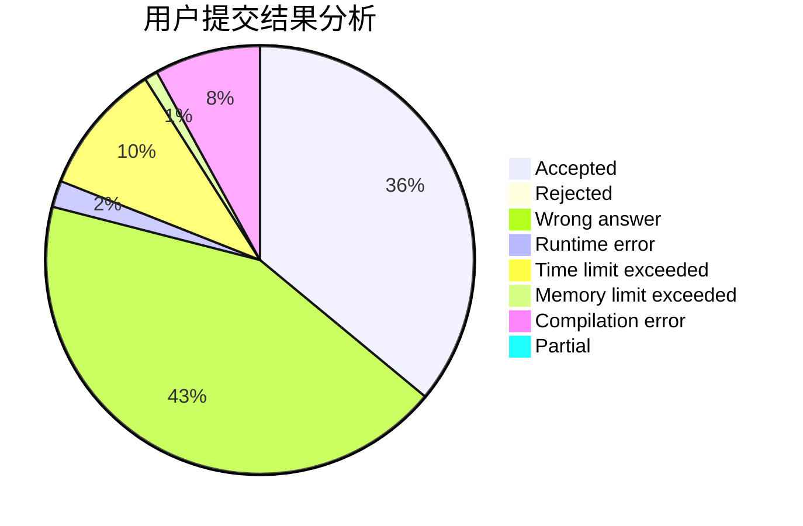
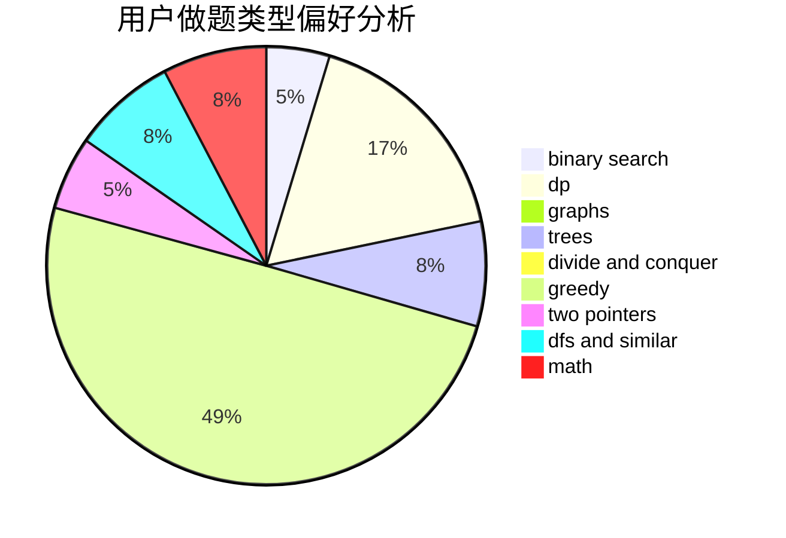

# xing89qs

<!-- tabs:start -->

#### **用户提交结果分析**

#### **用户做题类型偏好分析**

<!-- tabs:end -->
# 推荐题目
[13131](https://codeforces.com/contest/1313/problem/1)
[13681](https://codeforces.com/contest/1368/problem/1)
[1458C](https://codeforces.com/contest/1458/problem/C)
[1169A](https://codeforces.com/contest/1169/problem/A)
[117A](https://codeforces.com/contest/117/problem/A)
[372B](https://codeforces.com/contest/372/problem/B)
[490F](https://codeforces.com/contest/490/problem/F)
[1250H](https://codeforces.com/contest/1250/problem/H)
[818E](https://codeforces.com/contest/818/problem/E)
[534F](https://codeforces.com/contest/534/problem/F)
