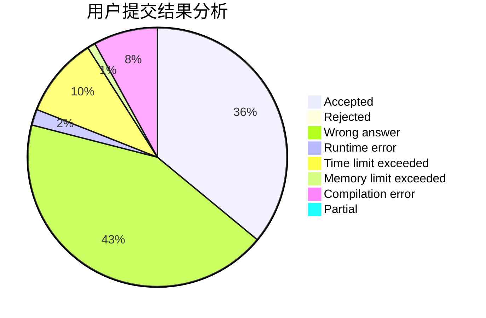
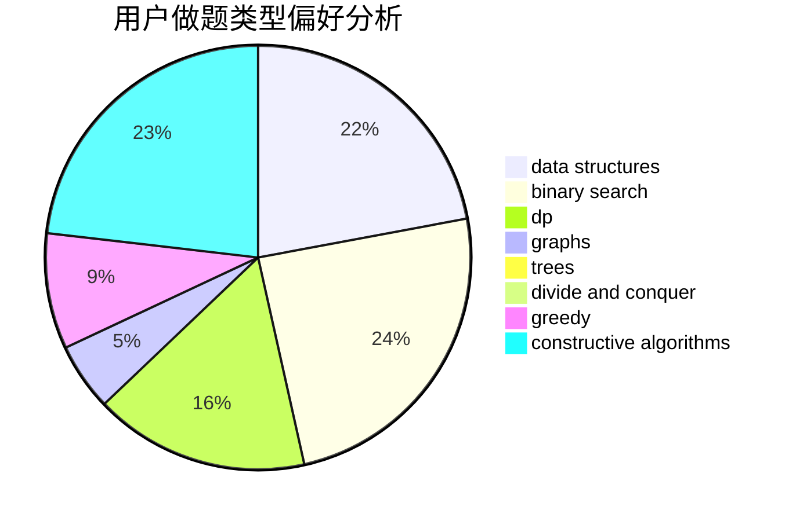

# xing89qs

<!-- tabs:start -->

#### **用户提交结果分析**

#### **用户做题类型偏好分析**

#### **用户错题知识点分析**

<!-- tabs:end -->
# 推荐题目
[1304C](https://codeforces.com/contest/1304/problem/C)		dp,
                        greedy,
                        implementation,
                        sortings,
                        two pointers		  
[135B](https://codeforces.com/contest/135/problem/B)		brute force,
                        geometry,
                        math		  
[1450A](https://codeforces.com/contest/1450/problem/A)		constructive algorithms,
                        sortings		  
[1166B](https://codeforces.com/contest/1166/problem/B)		constructive algorithms,
                        math,
                        number theory		  
[1176D](https://codeforces.com/contest/1176/problem/D)		dfs and similar,
                        graphs,
                        greedy,
                        number theory,
                        sortings		  
[346E](https://codeforces.com/contest/346/problem/E)		math,
                        number theory		  
[472C](https://codeforces.com/contest/472/problem/C)		greedy		  
[1245F](https://codeforces.com/contest/1245/problem/F)		bitmasks,
                        brute force,
                        combinatorics,
                        dp		  
[802O](https://codeforces.com/contest/802/problem/O)		binary search,
                        data structures,
                        flows		  
[510E](https://codeforces.com/contest/510/problem/E)		flows		  
