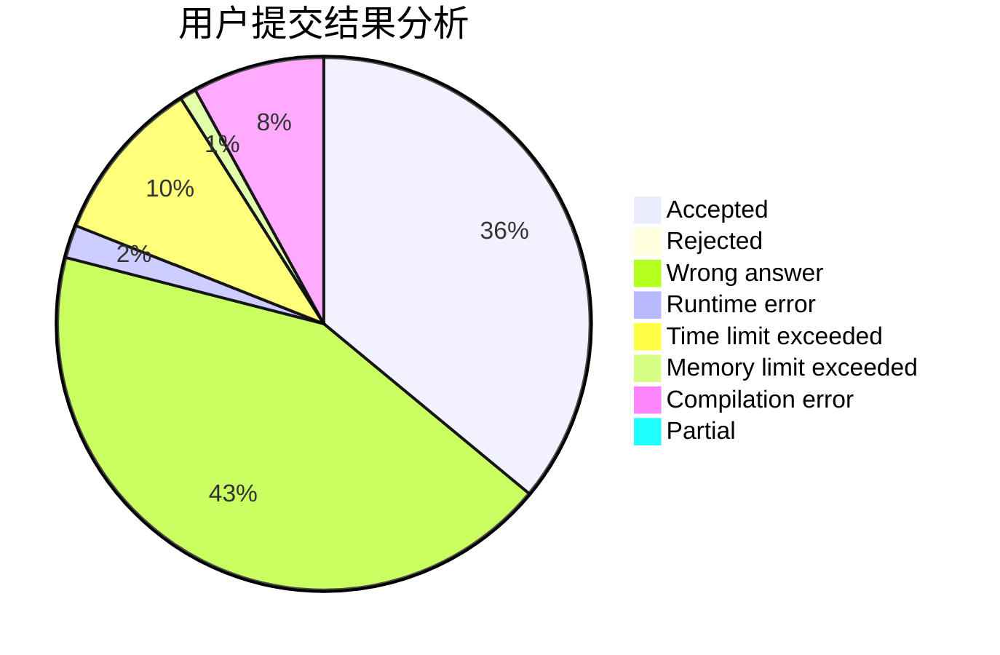
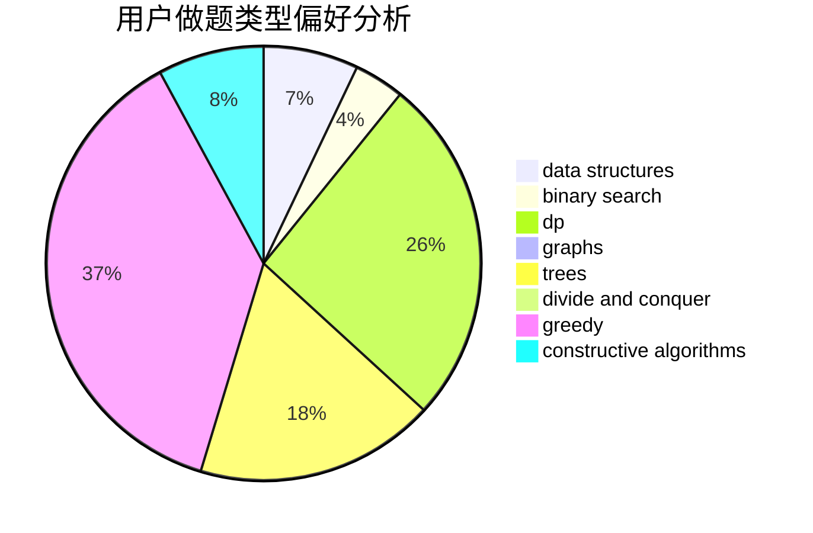

# xing89qs

<!-- tabs:start -->

#### **用户提交结果分析**

#### **用户做题类型偏好分析**

#### **用户错题知识点分析**

<!-- tabs:end -->
# 推荐题目
[13131](https://codeforces.com/contest/1313/problem/1)		dsu,graphs,sortings,trees		  
[13681](https://codeforces.com/contest/1368/problem/1)		dsu,graphs,sortings,trees		  
[1458C](https://codeforces.com/contest/1458/problem/C)		math,
                        matrices		  
[1169A](https://codeforces.com/contest/1169/problem/A)		implementation,
                        math		  
[117A](https://codeforces.com/contest/117/problem/A)		implementation,
                        math		  
[372B](https://codeforces.com/contest/372/problem/B)		brute force,
                        divide and conquer,
                        dp		  
[490F](https://codeforces.com/contest/490/problem/F)		data structures,
                        dfs and similar,
                        dp,
                        trees		  
[1250H](https://codeforces.com/contest/1250/problem/H)		math		  
[818E](https://codeforces.com/contest/818/problem/E)		binary search,
                        data structures,
                        number theory,
                        two pointers		  
[534F](https://codeforces.com/contest/534/problem/F)		bitmasks,
                        dp,
                        hashing,
                        meet-in-the-middle		  
