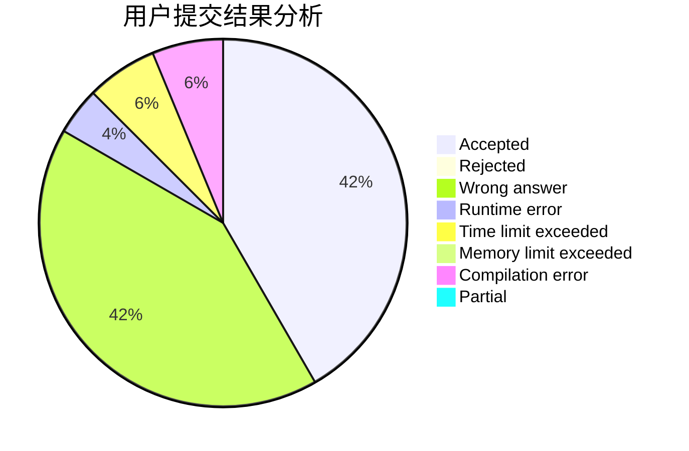
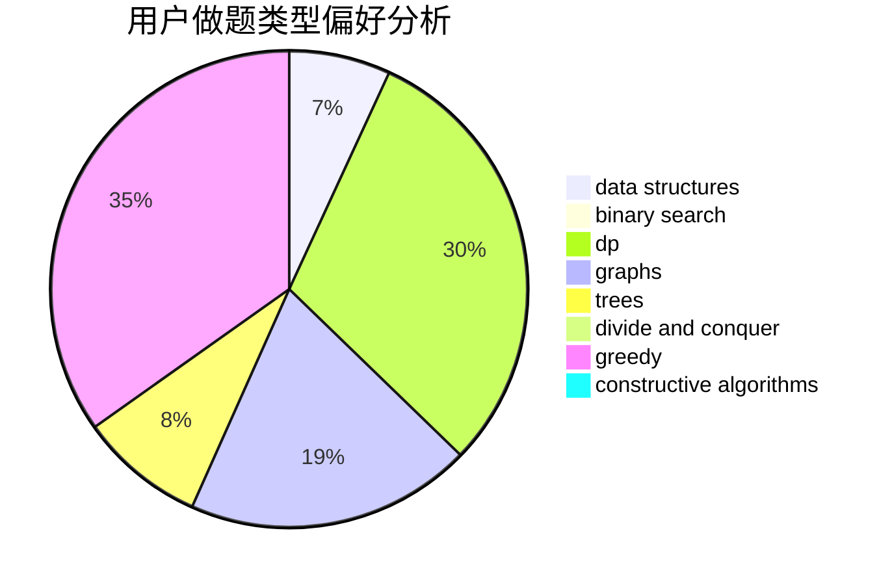

# xinyu2020

<!-- tabs:start -->

#### **用户提交结果分析**

#### **用户做题类型偏好分析**

#### **用户错题知识点分析**

<!-- tabs:end -->
# 推荐题目
[794E](https://codeforces.com/contest/794/problem/E)		games,
                        math		  
[627D](https://codeforces.com/contest/627/problem/D)		binary search,
                        dfs and similar,
                        dp,
                        graphs,
                        greedy,
                        trees		  
[1464D](https://codeforces.com/contest/1464/problem/D)		dsu,graphs,sortings,trees		  
[588B](https://codeforces.com/contest/588/problem/B)		math		  
[1030A](https://codeforces.com/contest/1030/problem/A)		implementation		  
[571E](https://codeforces.com/contest/571/problem/E)		math		  
[1254A](https://codeforces.com/contest/1254/problem/A)		constructive algorithms,
                        greedy,
                        implementation		  
[94C](https://codeforces.com/contest/94/problem/C)		dsu,graphs,sortings,trees		  
[825G](https://codeforces.com/contest/825/problem/G)		dfs and similar,
                        graphs,
                        trees		  
[982E](https://codeforces.com/contest/982/problem/E)		geometry,
                        number theory		  
