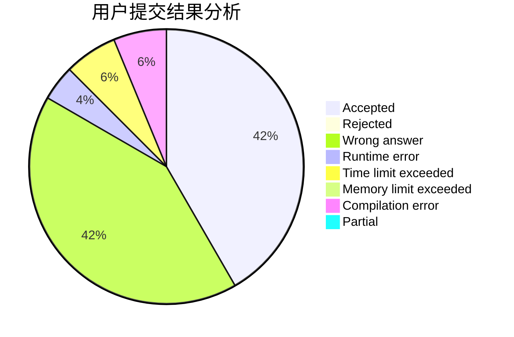
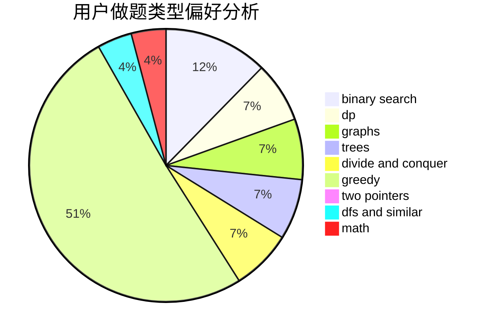

# xinyu2020

<!-- tabs:start -->

#### **用户提交结果分析**

#### **用户做题类型偏好分析**

<!-- tabs:end -->
# 推荐题目
[809E](https://codeforces.com/contest/809/problem/E)
[653D](https://codeforces.com/contest/653/problem/D)
[1471E](https://codeforces.com/contest/1471/problem/E)
[608D](https://codeforces.com/contest/608/problem/D)
[1030D](https://codeforces.com/contest/1030/problem/D)
[592B](https://codeforces.com/contest/592/problem/B)
[1261A](https://codeforces.com/contest/1261/problem/A)
[967B](https://codeforces.com/contest/967/problem/B)
[845C](https://codeforces.com/contest/845/problem/C)
[998C](https://codeforces.com/contest/998/problem/C)
