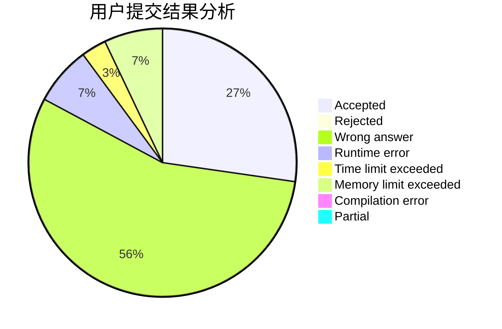
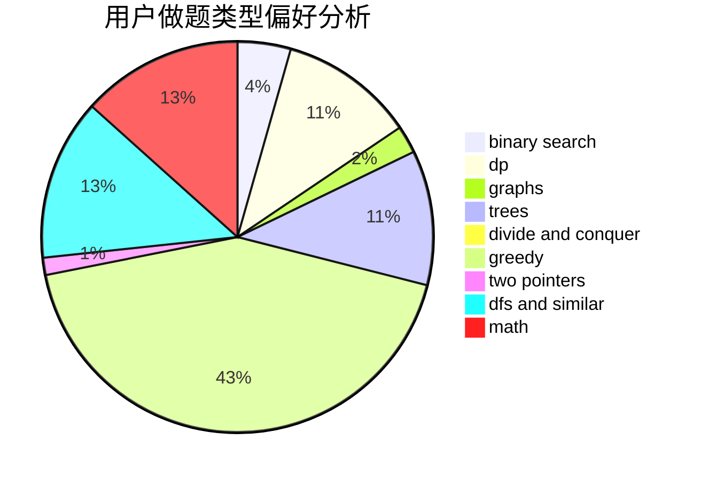

# xiong_6

<!-- tabs:start -->

#### **用户提交结果分析**

#### **用户做题类型偏好分析**

<!-- tabs:end -->
# 推荐题目
[615D](https://codeforces.com/contest/615/problem/D)
[1157G](https://codeforces.com/contest/1157/problem/G)
[1401E](https://codeforces.com/contest/1401/problem/E)
[1182F](https://codeforces.com/contest/1182/problem/F)
[1013E](https://codeforces.com/contest/1013/problem/E)
[1082B](https://codeforces.com/contest/1082/problem/B)
[1080E](https://codeforces.com/contest/1080/problem/E)
[353D](https://codeforces.com/contest/353/problem/D)
[1245C](https://codeforces.com/contest/1245/problem/C)
[862D](https://codeforces.com/contest/862/problem/D)
