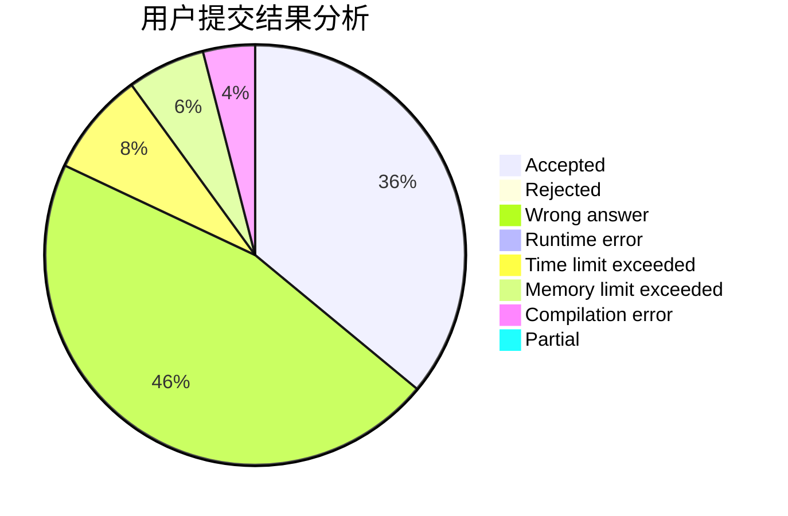
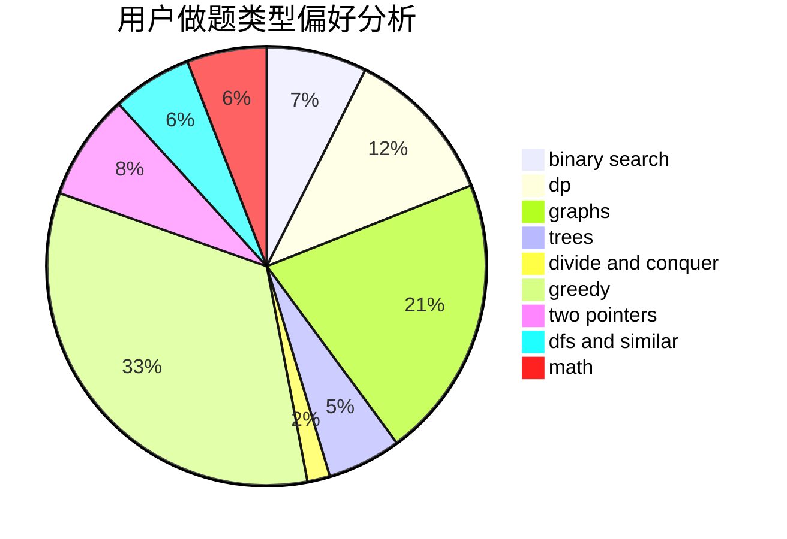

# xiong_7

<!-- tabs:start -->

#### **用户提交结果分析**

#### **用户做题类型偏好分析**

<!-- tabs:end -->
# 推荐题目
[835C](https://codeforces.com/contest/835/problem/C)
[875F](https://codeforces.com/contest/875/problem/F)
[899D](https://codeforces.com/contest/899/problem/D)
[838E](https://codeforces.com/contest/838/problem/E)
[17C](https://codeforces.com/contest/17/problem/C)
[424D](https://codeforces.com/contest/424/problem/D)
[6702](https://codeforces.com/contest/670/problem/2)
[717I](https://codeforces.com/contest/717/problem/I)
[886A](https://codeforces.com/contest/886/problem/A)
[652F](https://codeforces.com/contest/652/problem/F)
