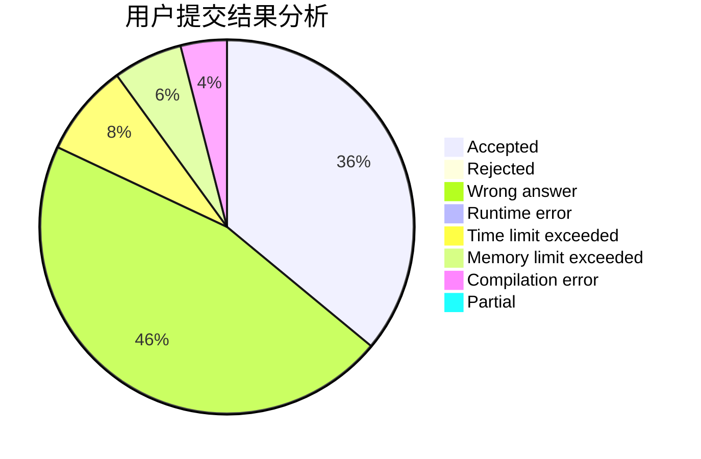
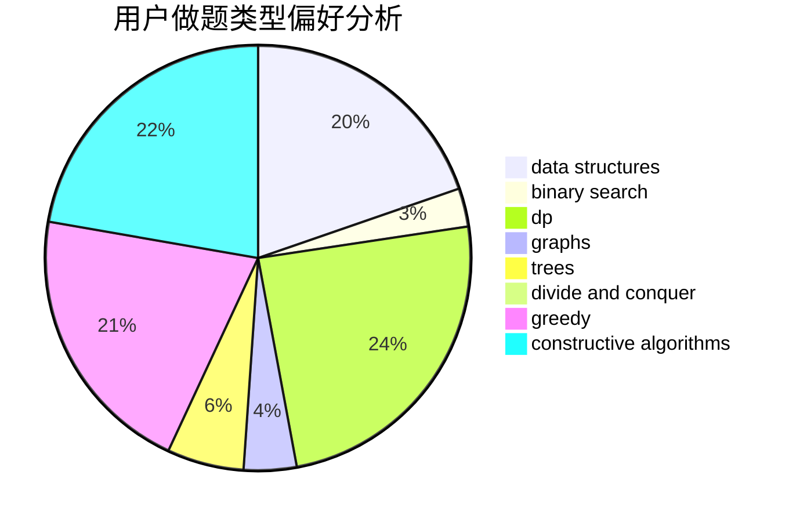

# xiong_7

<!-- tabs:start -->

#### **用户提交结果分析**

#### **用户做题类型偏好分析**

#### **用户错题知识点分析**

<!-- tabs:end -->
# 推荐题目
[835C](https://codeforces.com/contest/835/problem/C)		dp,
                        implementation		  
[875F](https://codeforces.com/contest/875/problem/F)		dsu,
                        graphs,
                        greedy		  
[899D](https://codeforces.com/contest/899/problem/D)		constructive algorithms,
                        math		  
[838E](https://codeforces.com/contest/838/problem/E)		dp		  
[17C](https://codeforces.com/contest/17/problem/C)		dp		  
[424D](https://codeforces.com/contest/424/problem/D)		binary search,
                        brute force,
                        constructive algorithms,
                        data structures,
                        dp		  
[6702](https://codeforces.com/contest/670/problem/2)		dsu,graphs,sortings,trees		  
[717I](https://codeforces.com/contest/717/problem/I)		geometry		  
[886A](https://codeforces.com/contest/886/problem/A)		brute force		  
[652F](https://codeforces.com/contest/652/problem/F)		constructive algorithms,
                        math		  
