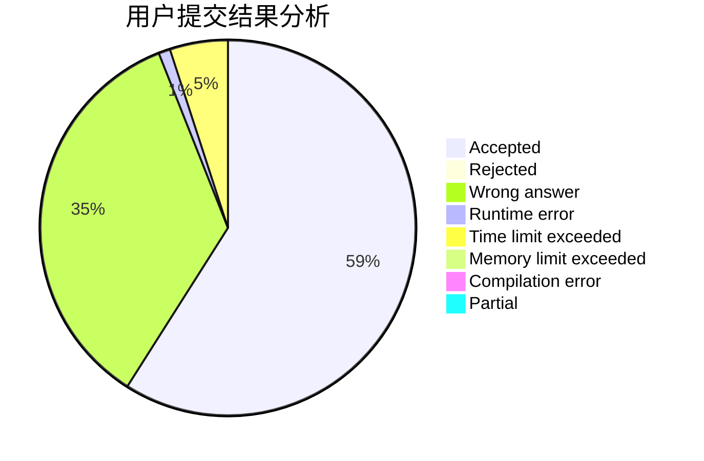
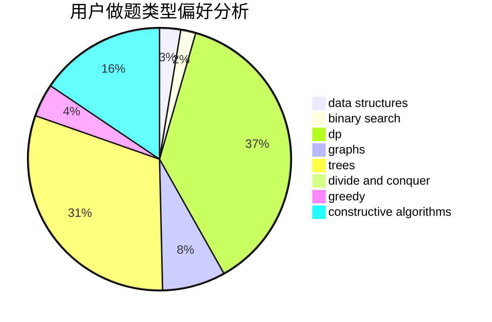
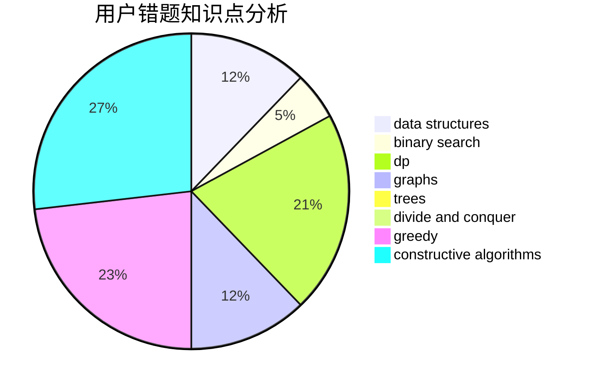

# xish

<!-- tabs:start -->

#### **用户提交结果分析**

#### **用户做题类型偏好分析**

#### **用户错题知识点分析**

<!-- tabs:end -->
# 推荐题目
[44E](https://codeforces.com/contest/44/problem/E)		dp		  
[1292F](https://codeforces.com/contest/1292/problem/F)		bitmasks,
                        combinatorics,
                        dp		  
[931F](https://codeforces.com/contest/931/problem/F)		dsu,graphs,sortings,trees		  
[617B](https://codeforces.com/contest/617/problem/B)		combinatorics		  
[193B](https://codeforces.com/contest/193/problem/B)		brute force		  
[1269B](https://codeforces.com/contest/1269/problem/B)		brute force,
                        sortings		  
[962F](https://codeforces.com/contest/962/problem/F)		dfs and similar,
                        graphs,
                        trees		  
[545A](https://codeforces.com/contest/545/problem/A)		implementation		  
[903B](https://codeforces.com/contest/903/problem/B)		greedy,
                        implementation		  
[1237G](https://codeforces.com/contest/1237/problem/G)		data structures,
                        dp,
                        greedy		  
