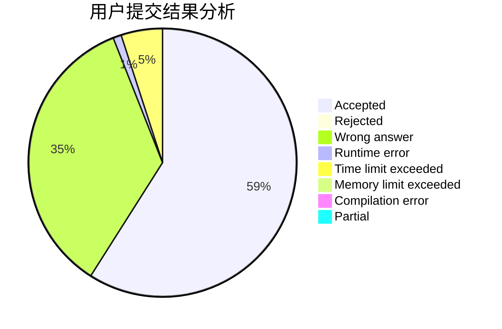
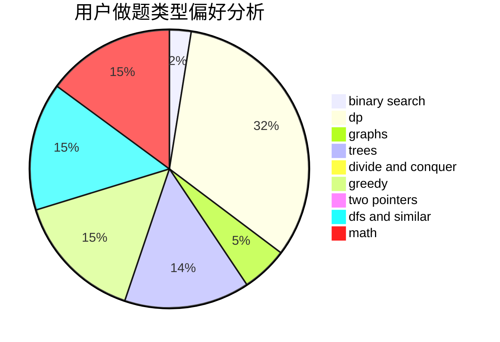

# xish

<!-- tabs:start -->

#### **用户提交结果分析**

#### **用户做题类型偏好分析**

<!-- tabs:end -->
# 推荐题目
[44E](https://codeforces.com/contest/44/problem/E)
[1292F](https://codeforces.com/contest/1292/problem/F)
[931F](https://codeforces.com/contest/931/problem/F)
[617B](https://codeforces.com/contest/617/problem/B)
[193B](https://codeforces.com/contest/193/problem/B)
[1269B](https://codeforces.com/contest/1269/problem/B)
[962F](https://codeforces.com/contest/962/problem/F)
[545A](https://codeforces.com/contest/545/problem/A)
[903B](https://codeforces.com/contest/903/problem/B)
[1237G](https://codeforces.com/contest/1237/problem/G)
