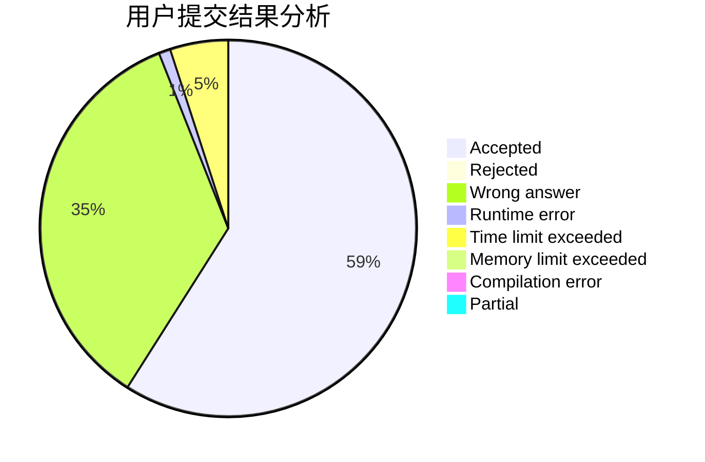
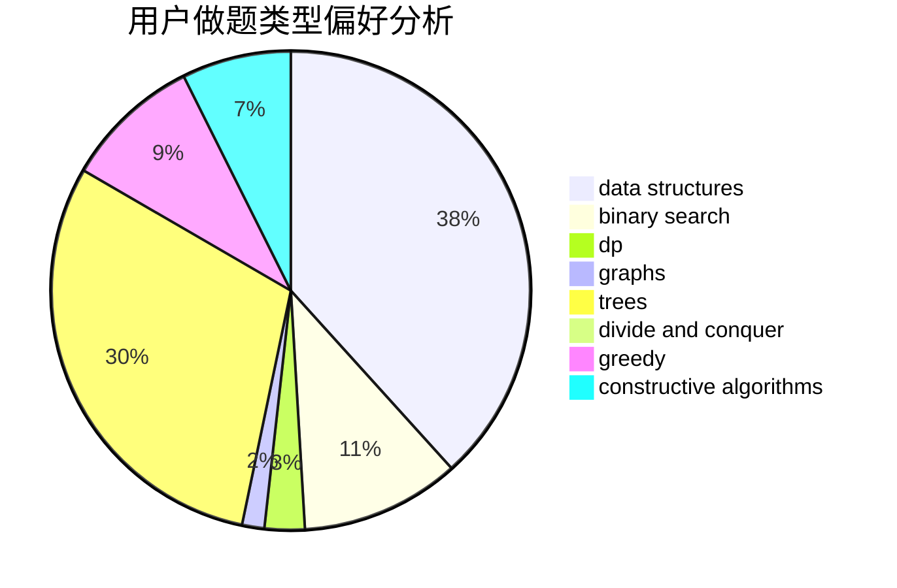
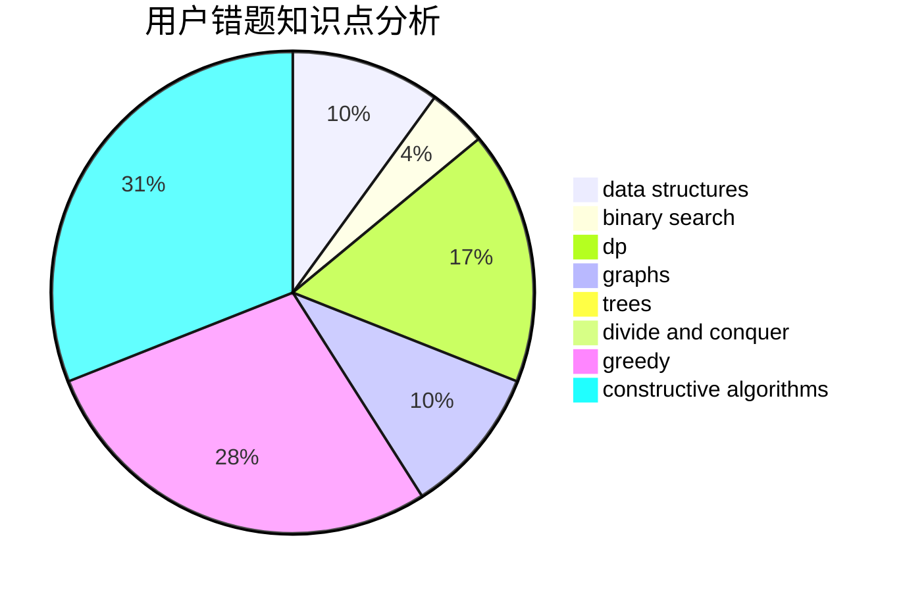

# xish

<!-- tabs:start -->

#### **用户提交结果分析**

#### **用户做题类型偏好分析**

#### **用户错题知识点分析**

<!-- tabs:end -->
# 推荐题目
[429A](https://codeforces.com/contest/429/problem/A)		dfs and similar,
                        trees		  
[1285E](https://codeforces.com/contest/1285/problem/E)		brute force,
                        constructive algorithms,
                        data structures,
                        dp,
                        graphs,
                        sortings,
                        trees,
                        two pointers		  
[913B](https://codeforces.com/contest/913/problem/B)		implementation,
                        trees		  
[599C](https://codeforces.com/contest/599/problem/C)		sortings		  
[166E](https://codeforces.com/contest/166/problem/E)		dp,
                        math,
                        matrices		  
[1263D](https://codeforces.com/contest/1263/problem/D)		dfs and similar,
                        dsu,
                        graphs		  
[946B](https://codeforces.com/contest/946/problem/B)		math,
                        number theory		  
[519E](https://codeforces.com/contest/519/problem/E)		binary search,
                        data structures,
                        dfs and similar,
                        dp,
                        trees		  
[884F](https://codeforces.com/contest/884/problem/F)		flows,
                        graphs,
                        greedy		  
[1229C](https://codeforces.com/contest/1229/problem/C)		dsu,graphs,sortings,trees		  
