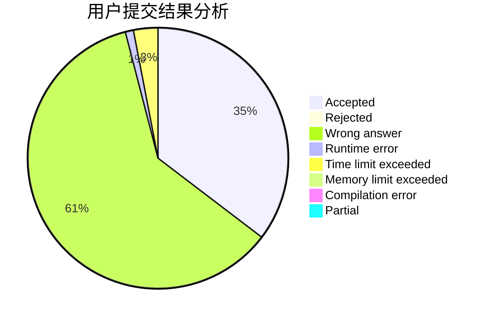
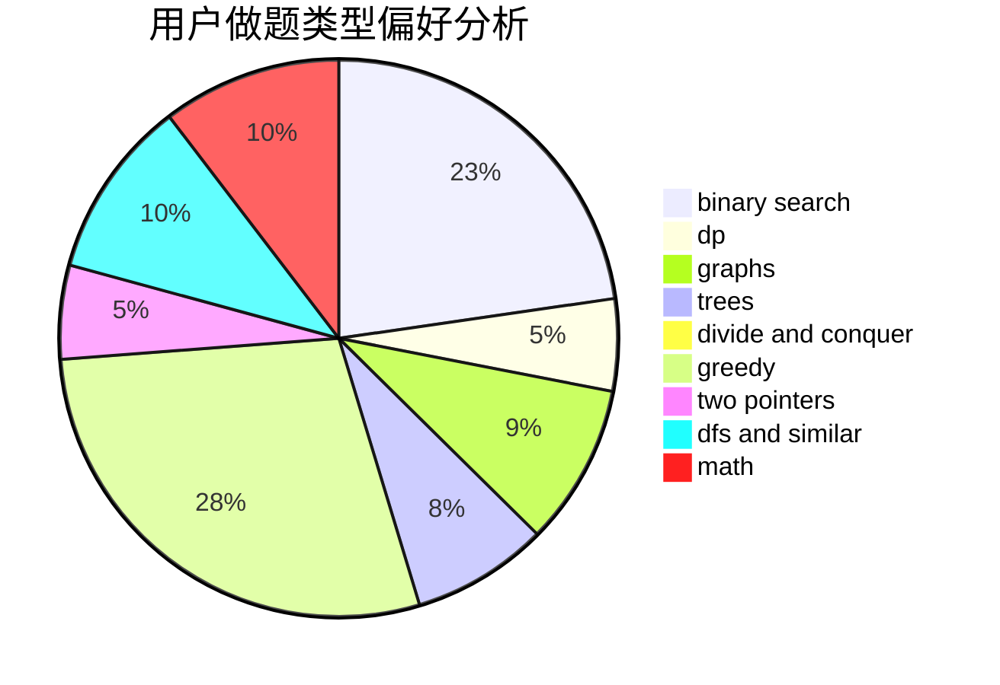

# xju_lyc

<!-- tabs:start -->

#### **用户提交结果分析**

#### **用户做题类型偏好分析**

<!-- tabs:end -->
# 推荐题目
[13573](https://codeforces.com/contest/1357/problem/3)
[1270I](https://codeforces.com/contest/1270/problem/I)
[1013A](https://codeforces.com/contest/1013/problem/A)
[1280A](https://codeforces.com/contest/1280/problem/A)
[521B](https://codeforces.com/contest/521/problem/B)
[144D](https://codeforces.com/contest/144/problem/D)
[303B](https://codeforces.com/contest/303/problem/B)
[964C](https://codeforces.com/contest/964/problem/C)
[606C](https://codeforces.com/contest/606/problem/C)
[483E](https://codeforces.com/contest/483/problem/E)
