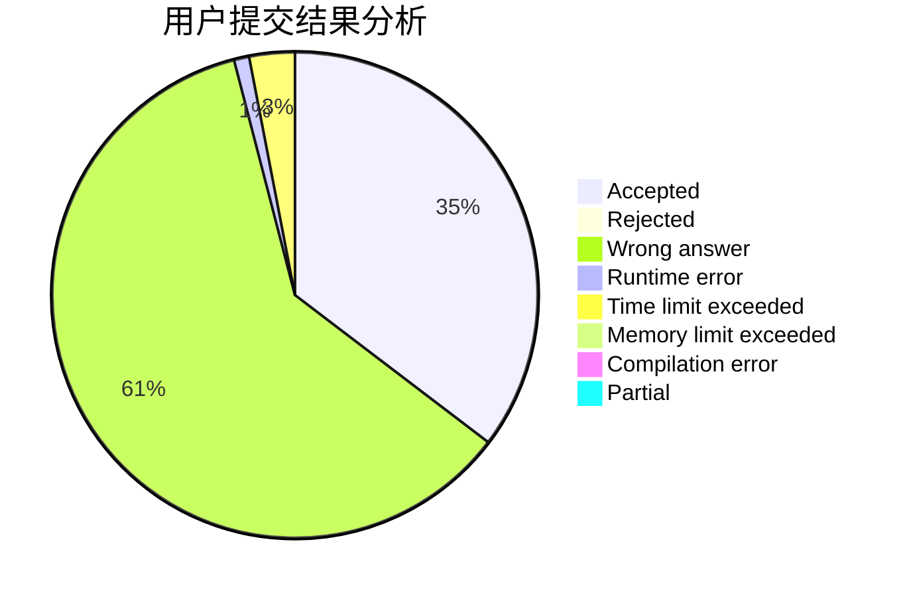
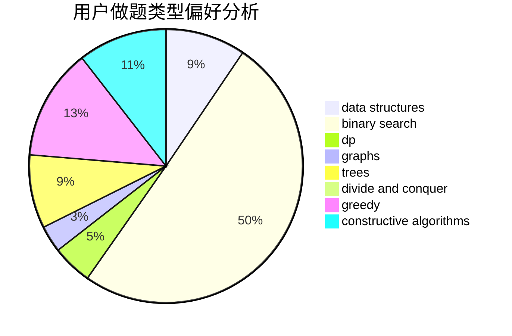

# xju_lyc

<!-- tabs:start -->

#### **用户提交结果分析**

#### **用户做题类型偏好分析**

#### **用户错题知识点分析**

<!-- tabs:end -->
# 推荐题目
[13573](https://codeforces.com/contest/1357/problem/3)		dsu,graphs,sortings,trees		  
[1270I](https://codeforces.com/contest/1270/problem/I)		constructive algorithms,
                        fft,
                        math		  
[1013A](https://codeforces.com/contest/1013/problem/A)		math		  
[1280A](https://codeforces.com/contest/1280/problem/A)		implementation,
                        math		  
[521B](https://codeforces.com/contest/521/problem/B)		dsu,graphs,sortings,trees		  
[144D](https://codeforces.com/contest/144/problem/D)		data structures,
                        dfs and similar,
                        graphs,
                        shortest paths		  
[303B](https://codeforces.com/contest/303/problem/B)		implementation,
                        math		  
[964C](https://codeforces.com/contest/964/problem/C)		dsu,graphs,sortings,trees		  
[606C](https://codeforces.com/contest/606/problem/C)		dsu,graphs,sortings,trees		  
[483E](https://codeforces.com/contest/483/problem/E)		dsu,graphs,sortings,trees		  
