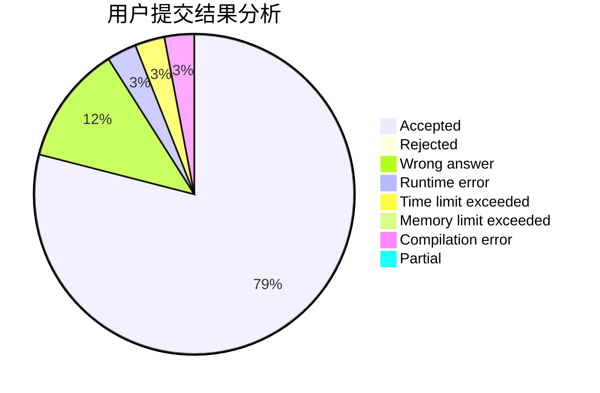
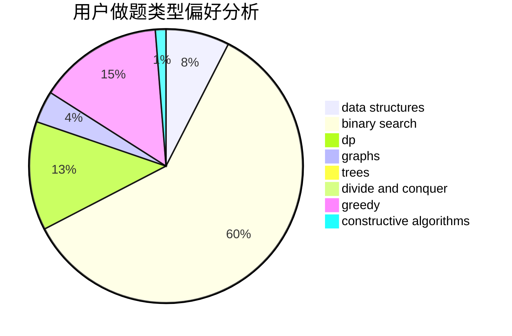

# xlk

<!-- tabs:start -->

#### **用户提交结果分析**

#### **用户做题类型偏好分析**

#### **用户错题知识点分析**

<!-- tabs:end -->
# 推荐题目
[991E](https://codeforces.com/contest/991/problem/E)		brute force,
                        combinatorics,
                        math		  
[578B](https://codeforces.com/contest/578/problem/B)		brute force,
                        greedy		  
[1016D](https://codeforces.com/contest/1016/problem/D)		constructive algorithms,
                        flows,
                        math		  
[131A](https://codeforces.com/contest/131/problem/A)		implementation,
                        strings		  
[13764](https://codeforces.com/contest/1376/problem/4)		dsu,graphs,sortings,trees		  
[988E](https://codeforces.com/contest/988/problem/E)		brute force,
                        greedy		  
[78C](https://codeforces.com/contest/78/problem/C)		dp,
                        games,
                        number theory		  
[1423E](https://codeforces.com/contest/1423/problem/E)		geometry		  
[729B](https://codeforces.com/contest/729/problem/B)		dp,
                        implementation		  
[934B](https://codeforces.com/contest/934/problem/B)		constructive algorithms,
                        implementation		  
