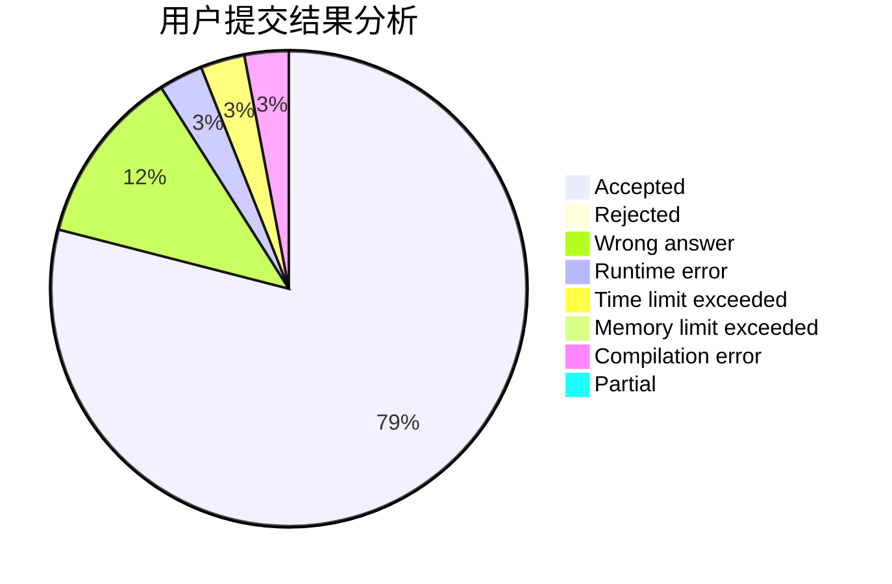
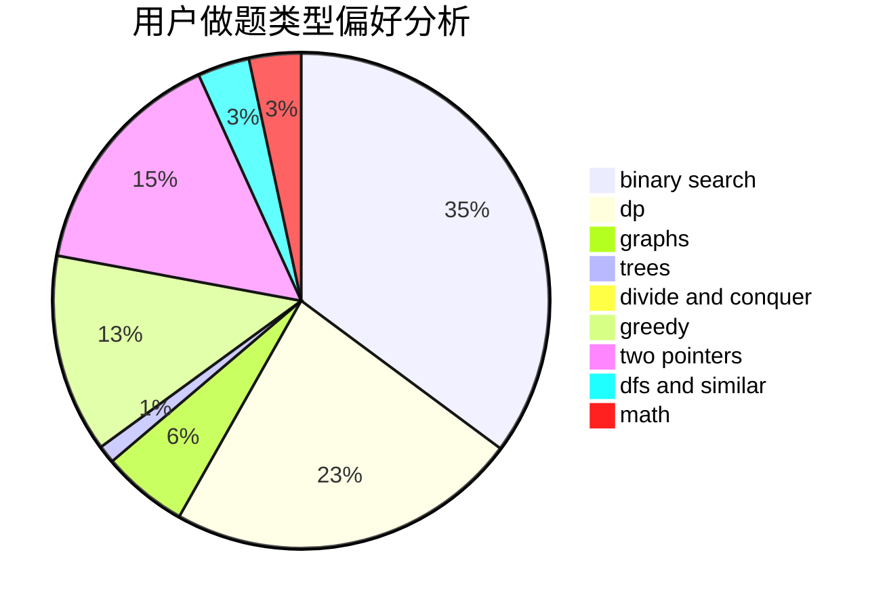

# xlk

<!-- tabs:start -->

#### **用户提交结果分析**

#### **用户做题类型偏好分析**

<!-- tabs:end -->
# 推荐题目
[991E](https://codeforces.com/contest/991/problem/E)
[578B](https://codeforces.com/contest/578/problem/B)
[1016D](https://codeforces.com/contest/1016/problem/D)
[131A](https://codeforces.com/contest/131/problem/A)
[13764](https://codeforces.com/contest/1376/problem/4)
[988E](https://codeforces.com/contest/988/problem/E)
[78C](https://codeforces.com/contest/78/problem/C)
[1423E](https://codeforces.com/contest/1423/problem/E)
[729B](https://codeforces.com/contest/729/problem/B)
[934B](https://codeforces.com/contest/934/problem/B)
