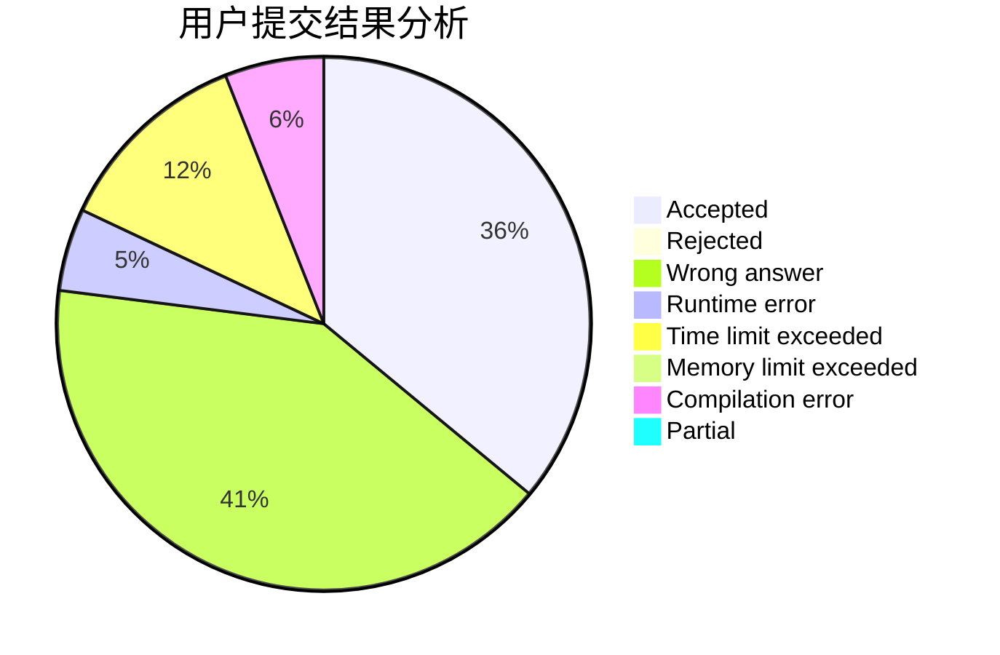
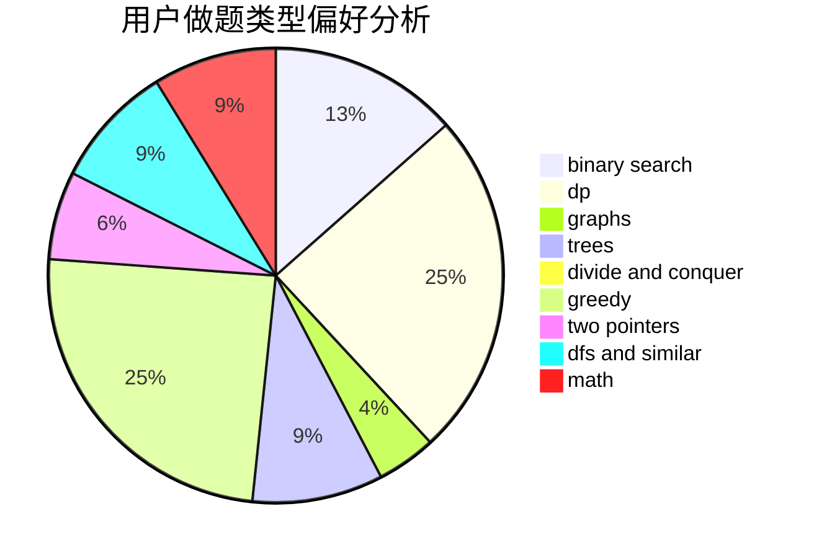

# xmx666

<!-- tabs:start -->

#### **用户提交结果分析**

#### **用户做题类型偏好分析**

<!-- tabs:end -->
# 推荐题目
[67A](https://codeforces.com/contest/67/problem/A)
[630F](https://codeforces.com/contest/630/problem/F)
[299C](https://codeforces.com/contest/299/problem/C)
[804B](https://codeforces.com/contest/804/problem/B)
[803B](https://codeforces.com/contest/803/problem/B)
[273D](https://codeforces.com/contest/273/problem/D)
[598E](https://codeforces.com/contest/598/problem/E)
[1150E](https://codeforces.com/contest/1150/problem/E)
[131A](https://codeforces.com/contest/131/problem/A)
[434C](https://codeforces.com/contest/434/problem/C)
