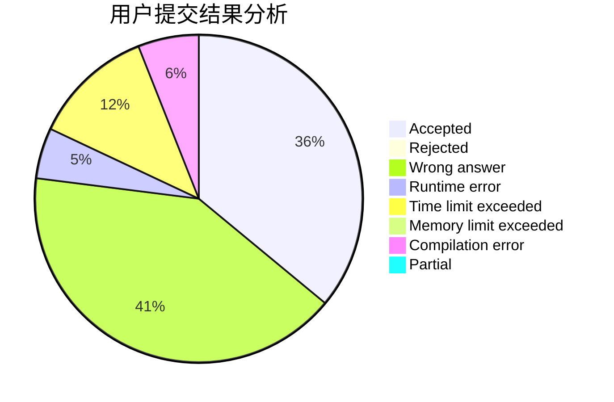
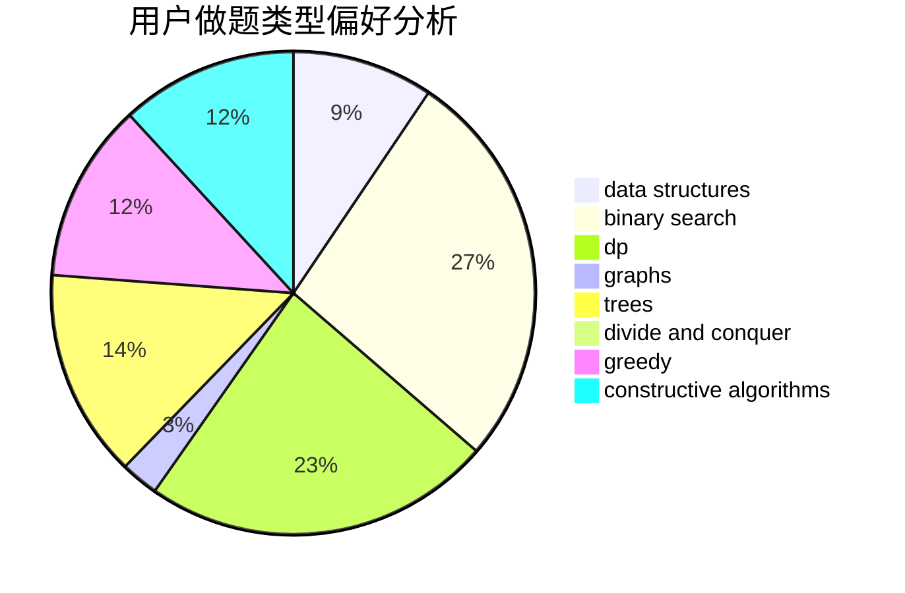
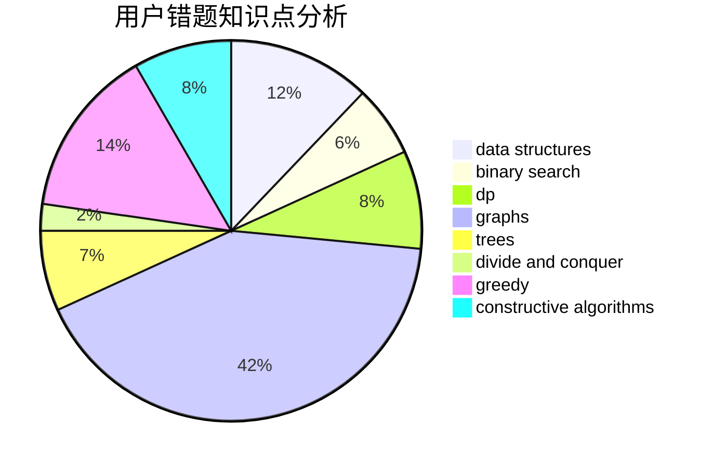

# xmx666

<!-- tabs:start -->

#### **用户提交结果分析**

#### **用户做题类型偏好分析**

#### **用户错题知识点分析**

<!-- tabs:end -->
# 推荐题目
[67A](https://codeforces.com/contest/67/problem/A)		dp,
                        graphs,
                        greedy,
                        implementation		  
[630F](https://codeforces.com/contest/630/problem/F)		combinatorics,
                        math		  
[299C](https://codeforces.com/contest/299/problem/C)		dsu,graphs,sortings,trees		  
[804B](https://codeforces.com/contest/804/problem/B)		combinatorics,
                        greedy,
                        implementation,
                        math		  
[803B](https://codeforces.com/contest/803/problem/B)		constructive algorithms		  
[273D](https://codeforces.com/contest/273/problem/D)		dp		  
[598E](https://codeforces.com/contest/598/problem/E)		brute force,
                        dp		  
[1150E](https://codeforces.com/contest/1150/problem/E)		dsu,graphs,sortings,trees		  
[131A](https://codeforces.com/contest/131/problem/A)		implementation,
                        strings		  
[434C](https://codeforces.com/contest/434/problem/C)		dsu,graphs,sortings,trees		  
