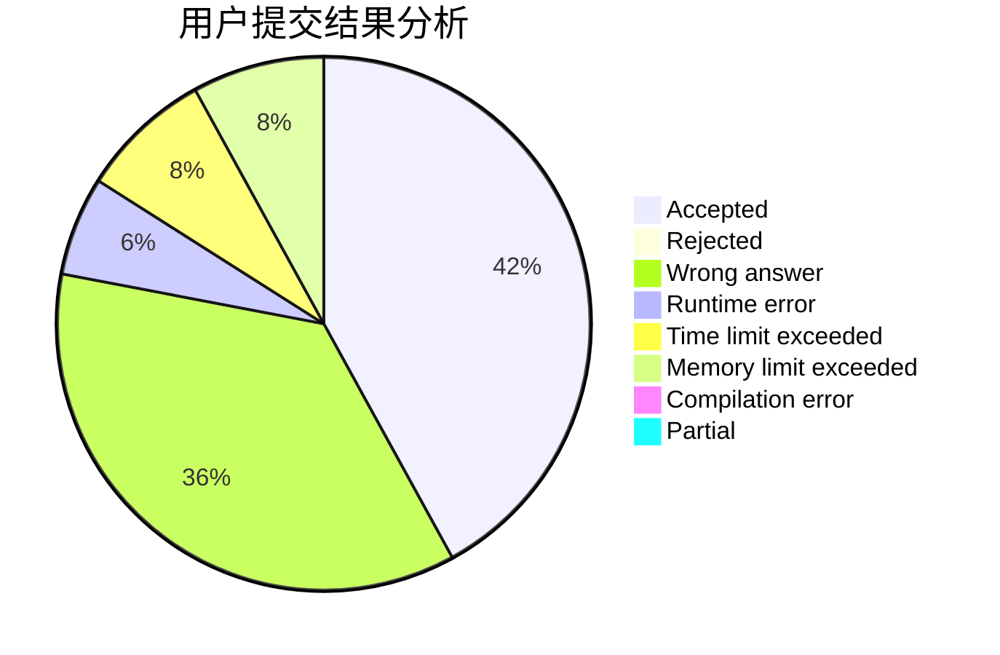
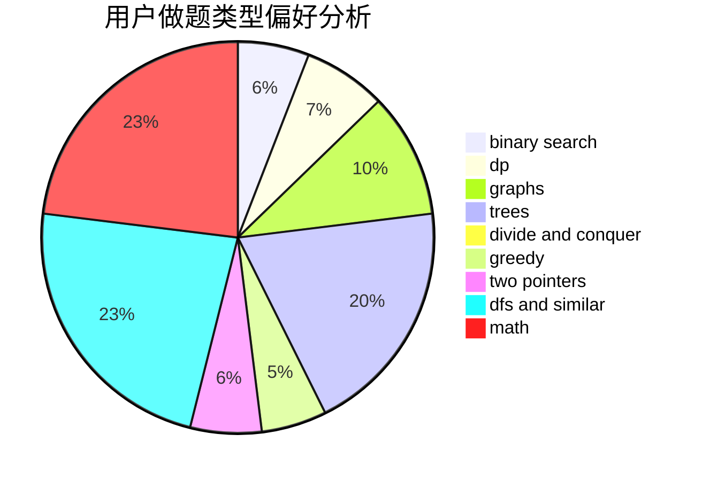

# xoslh

<!-- tabs:start -->

#### **用户提交结果分析**

#### **用户做题类型偏好分析**

<!-- tabs:end -->
# 推荐题目
[699C](https://codeforces.com/contest/699/problem/C)
[454A](https://codeforces.com/contest/454/problem/A)
[1361C](https://codeforces.com/contest/1361/problem/C)
[1101E](https://codeforces.com/contest/1101/problem/E)
[724F](https://codeforces.com/contest/724/problem/F)
[251A](https://codeforces.com/contest/251/problem/A)
[279D](https://codeforces.com/contest/279/problem/D)
[1064F](https://codeforces.com/contest/1064/problem/F)
[1164G](https://codeforces.com/contest/1164/problem/G)
[44C](https://codeforces.com/contest/44/problem/C)
