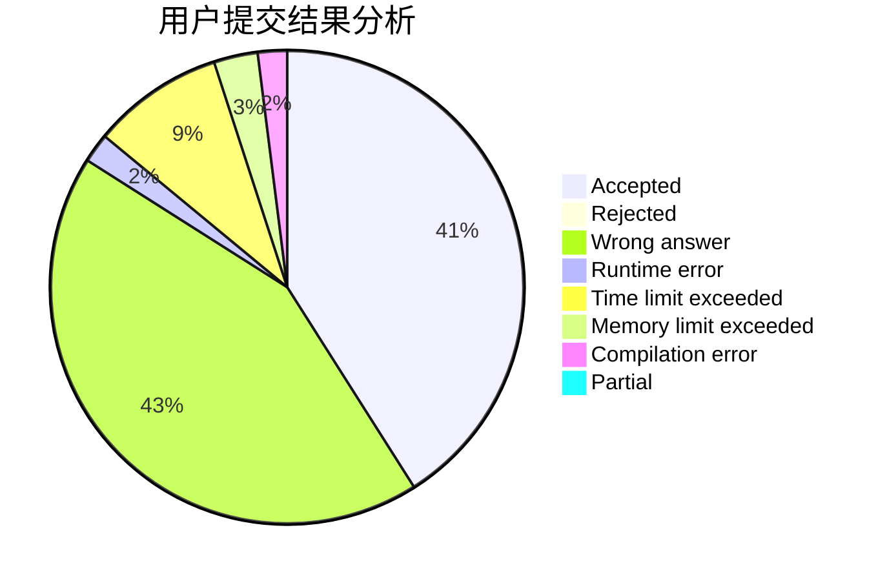
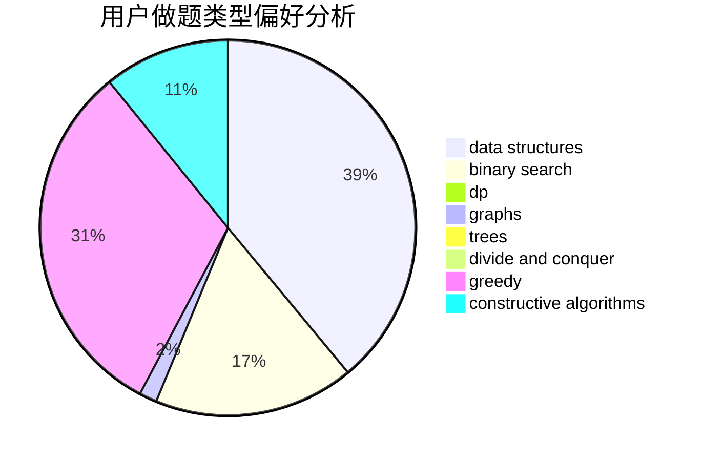
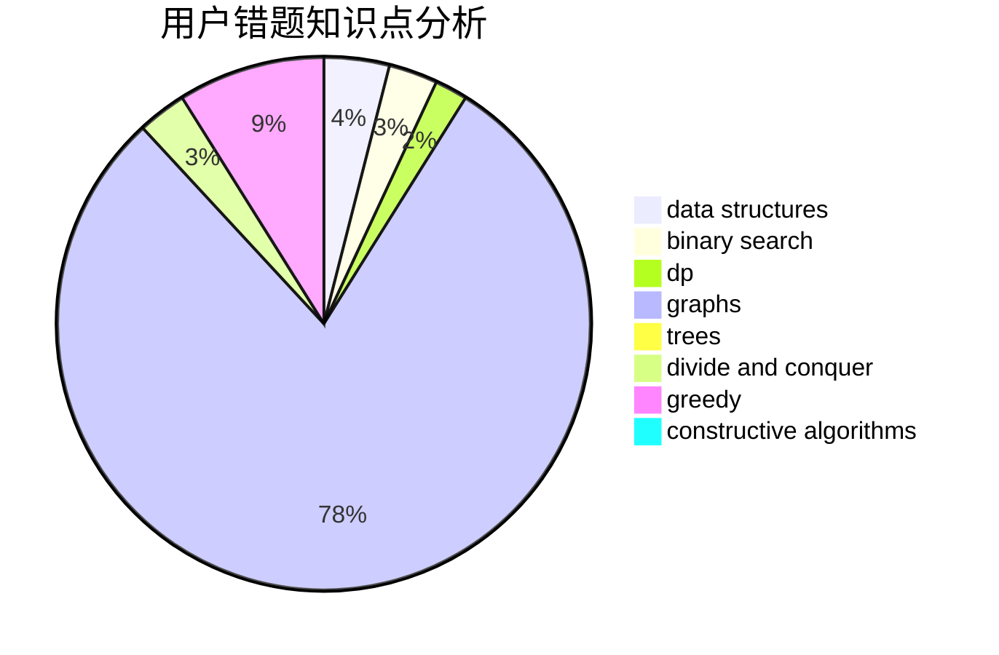

# Carered

<!-- tabs:start -->

#### **用户提交结果分析**

#### **用户做题类型偏好分析**

#### **用户错题知识点分析**

<!-- tabs:end -->
# 推荐题目
[650E](https://codeforces.com/contest/650/problem/E)		data structures,
                        dfs and similar,
                        dsu,
                        greedy,
                        trees		  
[650C](https://codeforces.com/contest/650/problem/C)		dfs and similar,
                        dp,
                        dsu,
                        graphs,
                        greedy		  
[478E](https://codeforces.com/contest/478/problem/E)		brute force,
                        dfs and similar,
                        meet-in-the-middle,
                        sortings		  
[1350D](https://codeforces.com/contest/1350/problem/D)		dsu,graphs,sortings,trees		  
[1362D](https://codeforces.com/contest/1362/problem/D)		dsu,graphs,sortings,trees		  
[1138A](https://codeforces.com/contest/1138/problem/A)		binary search,
                        greedy,
                        implementation		  
[598B](https://codeforces.com/contest/598/problem/B)		implementation,
                        strings		  
[1438D](https://codeforces.com/contest/1438/problem/D)		bitmasks,
                        constructive algorithms,
                        math		  
[650B](https://codeforces.com/contest/650/problem/B)		binary search,
                        brute force,
                        dp,
                        two pointers		  
[300D](https://codeforces.com/contest/300/problem/D)		dp,
                        fft		  
