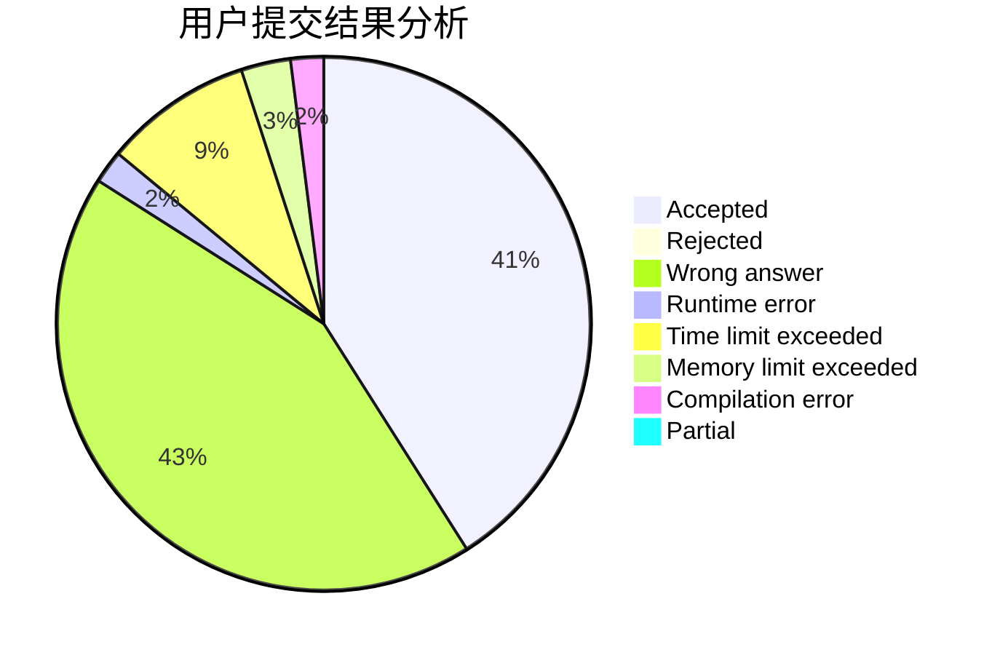
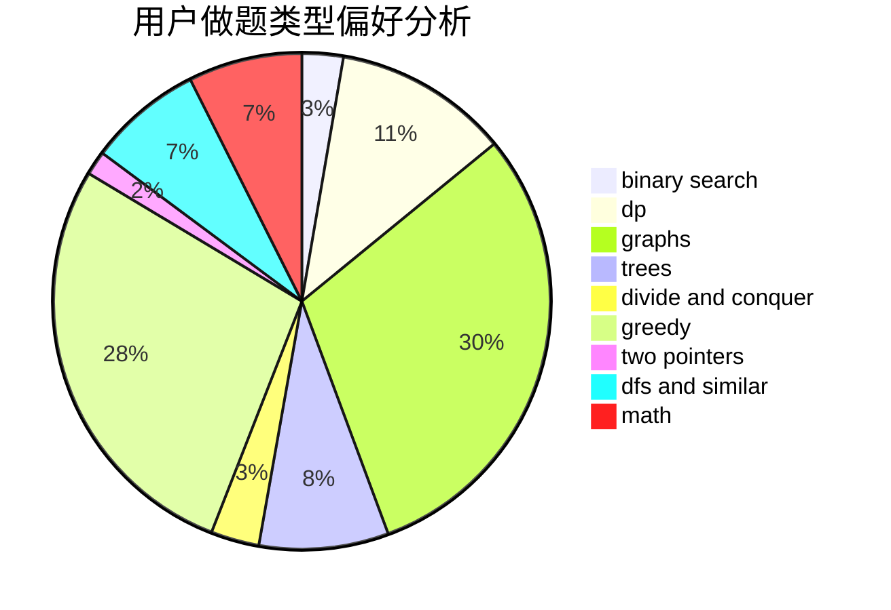

# Carered

<!-- tabs:start -->

#### **用户提交结果分析**

#### **用户做题类型偏好分析**

<!-- tabs:end -->
# 推荐题目
[674G](https://codeforces.com/contest/674/problem/G)
[674D](https://codeforces.com/contest/674/problem/D)
[498E](https://codeforces.com/contest/498/problem/E)
[13577](https://codeforces.com/contest/1357/problem/7)
[136C](https://codeforces.com/contest/136/problem/C)
[113C](https://codeforces.com/contest/113/problem/C)
[616A](https://codeforces.com/contest/616/problem/A)
[144E](https://codeforces.com/contest/144/problem/E)
[673B](https://codeforces.com/contest/673/problem/B)
[319B](https://codeforces.com/contest/319/problem/B)
