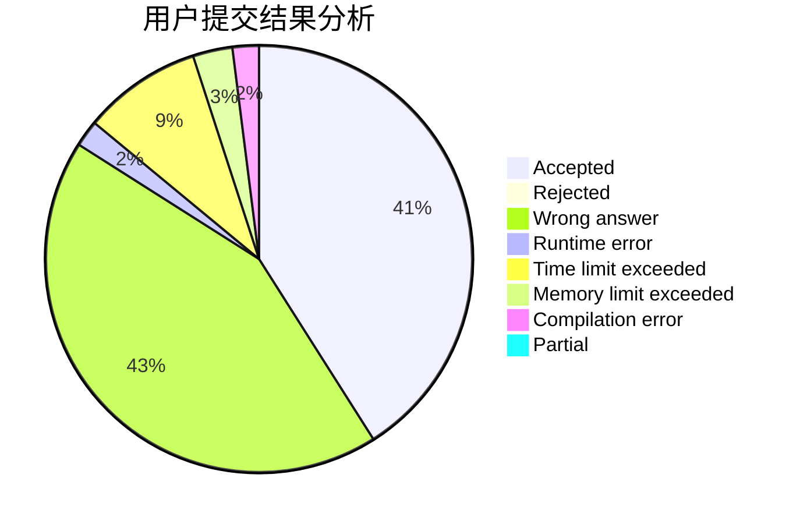
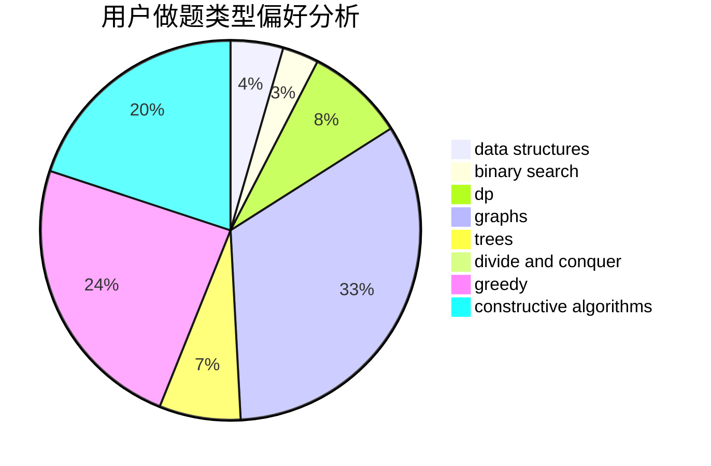

# Carered

<!-- tabs:start -->

#### **用户提交结果分析**

#### **用户做题类型偏好分析**

#### **用户错题知识点分析**

<!-- tabs:end -->
# 推荐题目
[674G](https://codeforces.com/contest/674/problem/G)		dsu,graphs,sortings,trees		  
[674D](https://codeforces.com/contest/674/problem/D)		dsu,graphs,sortings,trees		  
[498E](https://codeforces.com/contest/498/problem/E)		dp,
                        matrices		  
[13577](https://codeforces.com/contest/1357/problem/7)		dsu,graphs,sortings,trees		  
[136C](https://codeforces.com/contest/136/problem/C)		dsu,graphs,sortings,trees		  
[113C](https://codeforces.com/contest/113/problem/C)		brute force,
                        math,
                        number theory		  
[616A](https://codeforces.com/contest/616/problem/A)		implementation,
                        strings		  
[144E](https://codeforces.com/contest/144/problem/E)		data structures,
                        greedy		  
[673B](https://codeforces.com/contest/673/problem/B)		greedy,
                        implementation		  
[319B](https://codeforces.com/contest/319/problem/B)		data structures,
                        implementation		  
