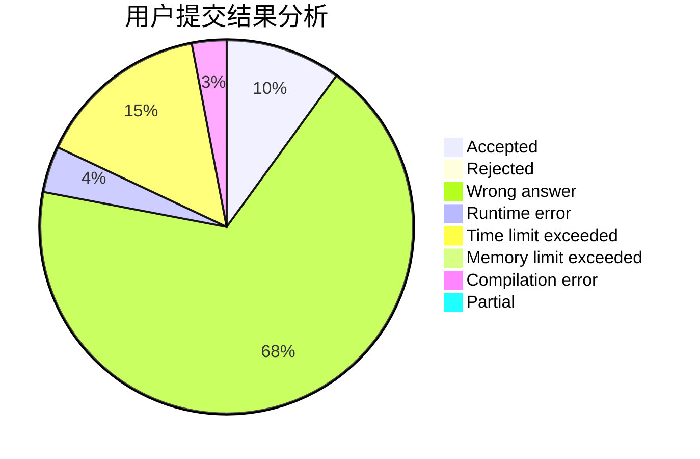
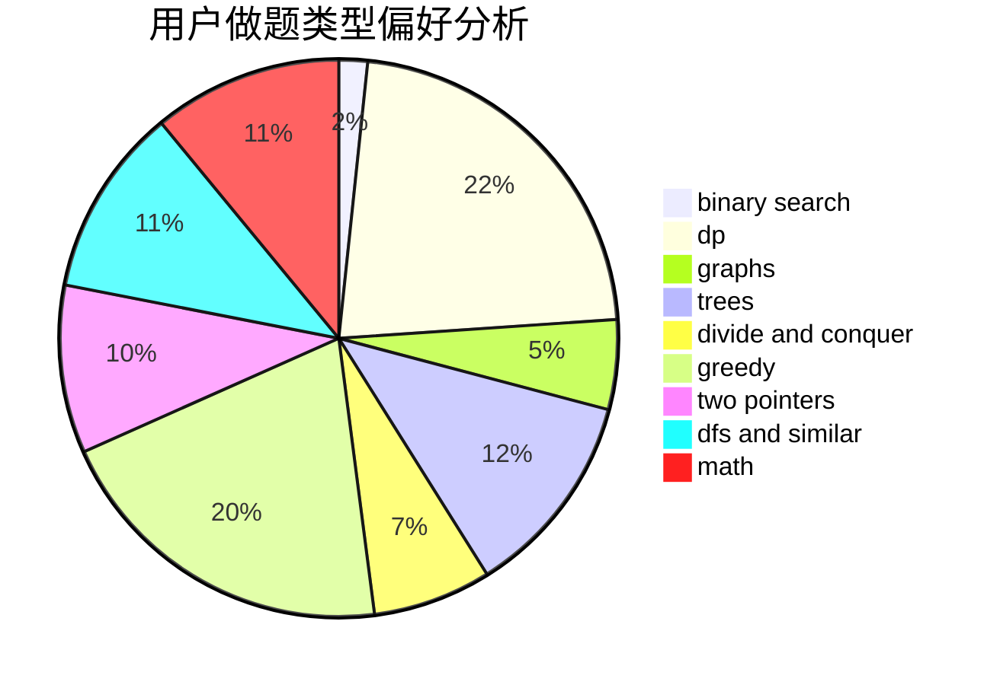

# xqly

<!-- tabs:start -->

#### **用户提交结果分析**

#### **用户做题类型偏好分析**

<!-- tabs:end -->
# 推荐题目
[788B](https://codeforces.com/contest/788/problem/B)
[11292](https://codeforces.com/contest/1129/problem/2)
[193D](https://codeforces.com/contest/193/problem/D)
[756A](https://codeforces.com/contest/756/problem/A)
[29E](https://codeforces.com/contest/29/problem/E)
[1260F](https://codeforces.com/contest/1260/problem/F)
[999C](https://codeforces.com/contest/999/problem/C)
[994C](https://codeforces.com/contest/994/problem/C)
[1005C](https://codeforces.com/contest/1005/problem/C)
[264B](https://codeforces.com/contest/264/problem/B)
